# Introduction

This lab covers some of the most commonly used clustering methods for
single-cell RNA-seq. We will use an example data set consisting of 2,700 PBMCs,
sequenced using 10x Genomics technology. In addition to performing the
clustering, we will also look at ways to visualize and compare clusterings.

Many parts of this tutorial are taken from, or inspired by, the online book
["Orchestrating single-cell analysis with
Bioconductor"](https://osca.bioconductor.org/), which is also an excellent
resource for additional discussions on many of the steps performed here.

# Load packages

We first load the required R packages. 


```r
suppressPackageStartupMessages({
  library(SummarizedExperiment)
  library(SingleCellExperiment)
  library(TENxPBMCData)
  library(scater)
  library(scran)
  library(BiocSingular)
  library(SC3)
  library(clustree)
  library(mclust)
  library(pheatmap)
  library(cluster)
  library(Seurat)
  library(dynamicTreeCut)
  library(igraph)
  library(ggplot2)
})
```

# Load and preprocess data

Next, we load the data (from the *[TENxPBMCData](https://bioconductor.org/packages/3.9/TENxPBMCData)* package), calculate
QC metrics with *[scater](https://bioconductor.org/packages/3.9/scater)*, normalize and run denoising PCA with 
*[scran](https://bioconductor.org/packages/3.9/scran)* and apply tSNE using *[scater](https://bioconductor.org/packages/3.9/scater)*, as we have seen
previously in the course.


```r
## Load data
sce <- TENxPBMCData::TENxPBMCData(dataset = "pbmc3k")
```

```
## snapshotDate(): 2019-04-29
```

```
## see ?TENxPBMCData and browseVignettes('TENxPBMCData') for documentation
```

```
## downloading 0 resources
```

```
## loading from cache 
##     'EH1607 : 1607'
```

```r
## Add column names, and use gene symbol as row names wherever possible
colnames(sce) <- paste0("Cell", seq_len(ncol(sce)))
rownames(sce) <- scater::uniquifyFeatureNames(
    ID = rowData(sce)$ENSEMBL_ID,
    names = rowData(sce)$Symbol_TENx
)

## Calculate QC metrics and remove cells with more than 5% reads from
## mitochondrial genes
MT <- rownames(sce)[grep("^MT-", rownames(sce))]
sce <- scater::calculateQCMetrics(
  object = sce, 
  feature_controls = list(MT = MT)
)
sce <- sce[, sce$pct_counts_MT < 5]

## Calculate size factors and normalize
## Note that the pre-clustering step has been excluded to save computational
## time
sce <- scran::computeSumFactors(sce, min.mean = 0.1)
sce <- scater::normalize(sce)
logcounts(sce) <- as.matrix(logcounts(sce))

## Fit variance trend and apply denoising PCA
new.trend <- scran::makeTechTrend(x = sce)
fit <- scran::trendVar(sce, use.spikes = FALSE, loess.args = list(span = 0.05))
fit$trend <- new.trend
dec <- scran::decomposeVar(fit = fit)
set.seed(123)
sce <- scran::denoisePCA(sce, technical = new.trend, BSPARAM = IrlbaParam())

## Apply tSNE
set.seed(123)
sce <- scater::runTSNE(sce, use_dimred = "PCA", perplexity = 30)
```

# Graph-based clustering

In this section, we will apply graph-based clustering, using both 
*[scran](https://bioconductor.org/packages/3.9/scran)* + *[igraph](https://CRAN.R-project.org/package=igraph)* and *[Seurat](https://CRAN.R-project.org/package=Seurat)*. Graph-based
clustering is commonly used for scRNA-seq, and often shows good performance.

## With scran + igraph

First, we will use *[scran](https://bioconductor.org/packages/3.9/scran)* to generate the shared nearest neighbor
graph, which will then be subjected to community detection using algorithms
implemented in the *[igraph](https://CRAN.R-project.org/package=igraph)* package. The SNN graph is constructed
using the `buildSNNGraph` function in *[scran](https://bioconductor.org/packages/3.9/scran)*, given the input
space to use (here, we use the PCA representation calculated above) and the
number of neighbors to use in the original KNN graph generation. We also specify
the type of weighting to use when generating the SNN graph. The default is `type
= "rank"`, which sets the weight between two nodes to _k - r/2_, where _r_ is
the smallest sum of ranks for any shared neighbors [@Xu2015-rw]. Alternatively,
`type = "number"` sets the weight to the number of shared neighbors.


```r
graph_k10 <- scran::buildSNNGraph(sce, k = 10, use.dimred = "PCA", type = "rank")
```

Once the SNN graph is generated, we can use any of the community detection
algorithms in *[igraph](https://CRAN.R-project.org/package=igraph)* to find the clusters. Here, we illustrate
two of these methods; the walktrap algorithm [@Pons2005-sh] and the Louvain
method [@Blondel2008-ym]. The cluster assignments are included in the
`membership` slot of the `communities` object returned by the community
detection.


```r
clust_k10_walktrap <- igraph::cluster_walktrap(graph_k10)$membership
clust_k10_louvain <- igraph::cluster_louvain(graph_k10)$membership
```

As discussed in the lecture, graph-based community detection algorithms are
often evaluated in terms of their _modularity_. Given a graph and a set of
cluster assignments, this can be calculated, for each cluster, using the
`clusterModularity` function from *[scran](https://bioconductor.org/packages/3.9/scran)*. With `get.values =
FALSE` (default), the returned values are proportional to the difference between
observed and expected edge weights between each pair of communities. By setting
`get.values = TRUE`, we can get the observed and expected edge weights between
each pair of clusters.


```r
## Get and plot modularity values
mod_k10_walktrap <- scran::clusterModularity(
  graph_k10, factor(clust_k10_walktrap),
  get.values = FALSE
)
pheatmap::pheatmap(
  mod_k10_walktrap, cluster_rows = FALSE, cluster_cols = FALSE,
  color = colorRampPalette(c("white", "blue"))(100)
)
```

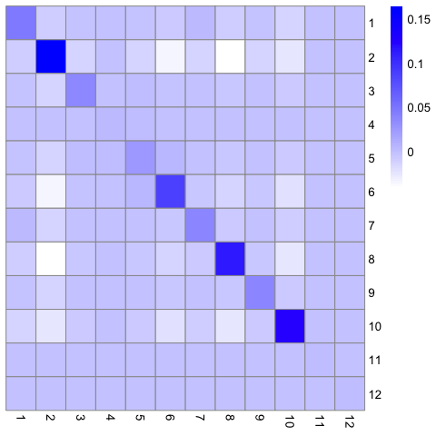<!-- -->

```r
## Get observed and expected edge weights, plot the log-ratio
mod_k10_walktrap <- scran::clusterModularity(
  graph_k10, factor(clust_k10_walktrap),
  get.values = TRUE
)
pheatmap::pheatmap(
  log2(mod_k10_walktrap$observed/mod_k10_walktrap$expected + 1), 
  cluster_rows = FALSE, cluster_cols = FALSE,
  color = colorRampPalette(c("white", "blue"))(100)
)
```

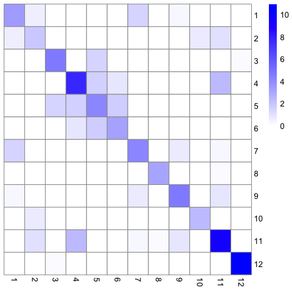<!-- -->

Repeat for the Louvain community detection:


```r
## Get and plot modularity values
mod_k10_louvain <- scran::clusterModularity(
  graph_k10, factor(clust_k10_louvain),
  get.values = FALSE
)
pheatmap::pheatmap(
  mod_k10_louvain, cluster_rows = FALSE, cluster_cols = FALSE,
  color = colorRampPalette(c("white", "blue"))(100)
)
```

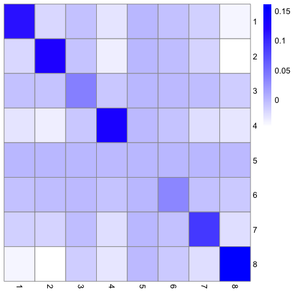<!-- -->

```r
## Get observed and expected edge weights, plot the log-ratio
mod_k10_louvain <- scran::clusterModularity(
  graph_k10, factor(clust_k10_louvain),
  get.values = TRUE
)
pheatmap::pheatmap(
  log2(mod_k10_louvain$observed/mod_k10_louvain$expected + 1), 
  cluster_rows = FALSE, cluster_cols = FALSE,
  color = colorRampPalette(c("white", "blue"))(100)
)
```

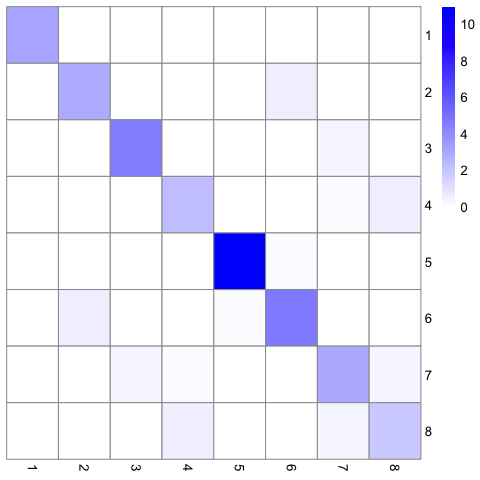<!-- -->

There are several ways in which we can explore the clustering results further.
For example, we can look at the number of inferred communities, and the number
of cells assigned to each of them:


```r
table(clust_k10_walktrap)
```

```
## clust_k10_walktrap
##   1   2   3   4   5   6   7   8   9  10  11  12 
## 197 692 161  31 150 331 162 339 137 422  10  11
```

```r
table(clust_k10_louvain)
```

```
## clust_k10_louvain
##   1   2   3   4   5   6   7   8 
## 342 520 154 458  11 153 356 649
```

We can also compare the assignments between the two community detection methods,
both numerically and graphically. A common metric for summarizing the agreement
between two partitionings of the same set of cells is the _adjusted Rand index_
[@Rand1971-ty; @Hubert1985-id] - the closer to 1 this value is, the more similar are the partitionings.


```r
table(clust_k10_walktrap, clust_k10_louvain)
```

```
##                   clust_k10_louvain
## clust_k10_walktrap   1   2   3   4   5   6   7   8
##                 1    0   0  16   0   0   0 178   3
##                 2    3   0   1  37   0   0   6 645
##                 3    0   8   0   0   0 153   0   0
##                 4    0  31   0   0   0   0   0   0
##                 5    0 150   0   0   0   0   0   0
##                 6    0 331   0   0   0   0   0   0
##                 7    0   0   0   0   0   0 162   0
##                 8  339   0   0   0   0   0   0   0
##                 9    0   0 137   0   0   0   0   0
##                 10   0   0   0 421   0   0   0   1
##                 11   0   0   0   0   0   0  10   0
##                 12   0   0   0   0  11   0   0   0
```

```r
pheatmap::pheatmap(table(clust_k10_walktrap, clust_k10_louvain))
```

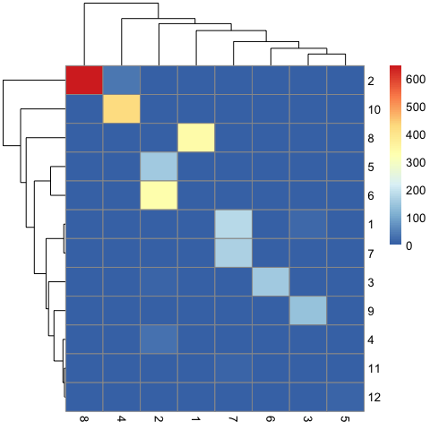<!-- -->

```r
mclust::adjustedRandIndex(clust_k10_walktrap, clust_k10_louvain)
```

```
## [1] 0.8273516
```

Finally, we often want to overlay the cluster assignments in a reduced dimension
representation, or in the original graph. One way of achieving the former is to
add the cluster labels to the _SingleCellExperiment_ object, and use the
`plotReducedDim` function from *[scater](https://bioconductor.org/packages/3.9/scater)* to visualize the data. The
latter can be achieved using functions from *[igraph](https://CRAN.R-project.org/package=igraph)*.


```r
## Add cluster assignments to the SingleCellExperiment object and visualize in
## tSNE representation
sce$cluster_walktrap_k10 <- factor(clust_k10_walktrap)
sce$cluster_louvain_k10 <- factor(clust_k10_louvain)
scater::plotReducedDim(sce, "TSNE", colour_by = "cluster_walktrap_k10")
```

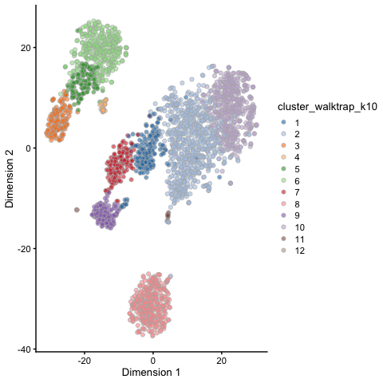<!-- -->

```r
scater::plotReducedDim(sce, "TSNE", colour_by = "cluster_louvain_k10")
```

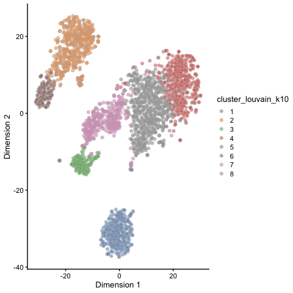<!-- -->


```r
## Define a set of colors to use (must be at least as many as the number of
## communities)
cols <- RColorBrewer::brewer.pal(n = 12, name = "Paired")
## Plot the graph, color by cluster assignment
igraph::plot.igraph(
  graph_k10, layout = layout_with_fr(graph_k10),
  vertex.color = cols[clust_k10_walktrap],
  vertex.size = 5, vertex.label = NA, main = "Walktrap"
)
```

<!-- -->

```r
igraph::plot.igraph(
  graph_k10, layout = layout_with_fr(graph_k10),
  vertex.color = cols[clust_k10_louvain],
  vertex.size = 5, vertex.label = NA, main = "Louvain"
)
```

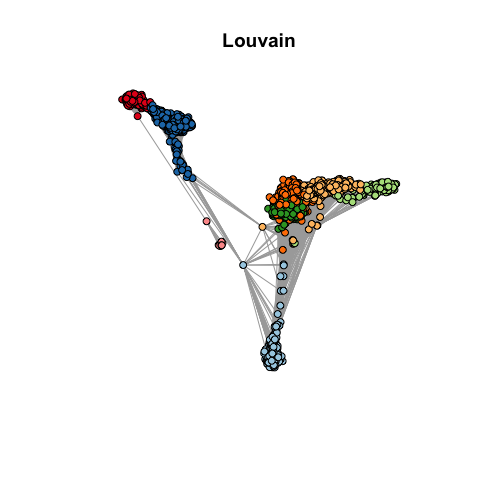<!-- -->

Next, let's try generating the graph with different number of neighbors. Notice
how it changes the number of communities that are detected. Feel free to explore
with different community algorithms from *[igraph](https://CRAN.R-project.org/package=igraph)* and change the
settings in other ways!


```r
## Smaller k
graph_k5 <- scran::buildSNNGraph(sce, k = 5, use.dimred = "PCA", type = "rank")
clust_k5_louvain <- igraph::cluster_louvain(graph_k5)$membership
table(clust_k5_louvain)
```

```
## clust_k5_louvain
##   1   2   3   4   5   6   7   8   9 
## 340 489  11 153  51 638 152 348 461
```

```r
pheatmap::pheatmap(table(clust_k5_louvain, clust_k10_louvain))
```

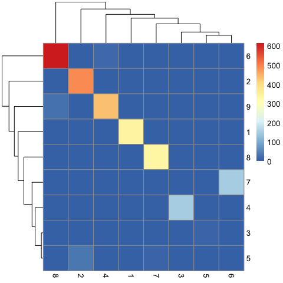<!-- -->

```r
## Larger k
graph_50 <- scran::buildSNNGraph(sce, k = 50, use.dimred = "PCA", type = "rank")
clust_k50_louvain <- igraph::cluster_louvain(graph_50)$membership
table(clust_k50_louvain)
```

```
## clust_k50_louvain
##   1   2   3   4   5 
## 342 575 489 564 673
```

```r
pheatmap::pheatmap(table(clust_k50_louvain, clust_k10_louvain))
```

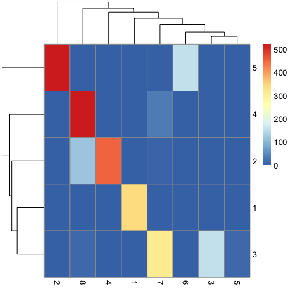<!-- -->

### Specifying the number of clusters

Some of the community detection algorithms in *[igraph](https://CRAN.R-project.org/package=igraph)* are
_hierarchical_, which implies that there is an underlying hierarchy in the
communities object that can be cut at a certain height in order to generate a
pre-specified number of clusters (they will still return an "optimized" number
of communities by default). In order to do this, we  must first generate the
communities object, and check whether the method that we have applied is
hierarchical.


```r
## Louvain is not hierarchical
comm_k10_louvain <- igraph::cluster_louvain(graph_k10)
igraph::is_hierarchical(comm_k10_louvain)
```

```
## [1] FALSE
```

```r
## Walktrap is hierarchical
comm_k10_walktrap <- igraph::cluster_walktrap(graph_k10)
igraph::is_hierarchical(comm_k10_walktrap)
```

```
## [1] TRUE
```

For hierarchical methods, we can then generate a given number of clusters using
the `cut_at` function from *[igraph](https://CRAN.R-project.org/package=igraph)*.


```r
table(igraph::cut_at(comm_k10_walktrap, no = 2))
```

```
## 
##    1    2 
## 2632   11
```

```r
table(igraph::cut_at(comm_k10_walktrap, no = 4))
```

```
## 
##    1    2    3    4 
## 1959  642   31   11
```

```r
table(igraph::cut_at(comm_k10_walktrap, no = 8))
```

```
## 
##    1    2    3    4    5    6    7    8 
##  369  481 1114  161   31  339  137   11
```

```r
table(igraph::cut_at(comm_k10_walktrap, no = 10))
```

```
## 
##    1    2    3    4    5    6    7    8    9   10 
##  481 1114  197  161   31  162  339  137   10   11
```

```r
table(igraph::cut_at(comm_k10_walktrap, no = 15))
```

```
## 
##   1   2   3   4   5   6   7   8   9  10  11  12  13  14  15 
##  31 150 331 162 124 181 339 137 568 422  49 112  16  10  11
```

## With Seurat

*[Seurat](https://CRAN.R-project.org/package=Seurat)* also implements a graph-based clustering, by default using
the Louvain community detection algorithm. Since *[Seurat](https://CRAN.R-project.org/package=Seurat)* does not
use the _SingleCellExperiment_ container, the first thing we need to do is to
create a Seurat object for the downstream analysis. We generate this from the
raw counts of the SingleCellExperiment object above, and apply the normalization
methods of *[Seurat](https://CRAN.R-project.org/package=Seurat)* to reprocess the data.


```r
so <- Seurat::CreateSeuratObject(
  counts = counts(sce), project = "pbmc3k", 
  min.cells = 3, min.features = 200
)
```

```
## Warning: Feature names cannot have underscores ('_'), replacing with dashes
## ('-')
```

```r
so <- Seurat::NormalizeData(
  so, normalization.method = "LogNormalize", scale.factor = 10000
)
so <- Seurat::FindVariableFeatures(so, selection.method = "vst", nfeatures = 2000)
so <- Seurat::ScaleData(so, features = rownames(so))
```

```
## Centering and scaling data matrix
```

```r
so <- Seurat::RunPCA(
  so, features = VariableFeatures(object = so), verbose = FALSE
)
```

Next, we create the nearest neighbor graph, and find the communities. Note that
*[Seurat](https://CRAN.R-project.org/package=Seurat)* allows the specification of the resolution parameter. This
will (implicitly) determine the number of communities, as discussed in the
lecture. Here, we specify a range of resolutions, which will generate a
collection of clustering results.


```r
so <- Seurat::FindNeighbors(so, dims = 1:10)
```

```
## Computing nearest neighbor graph
```

```
## Computing SNN
```

```r
so <- Seurat::FindClusters(
  so, resolution = seq(from = 0.1, to = 1, by = 0.1), verbose = FALSE
)
```

Finally, we can move the cluster labels back into the original
SingleCellExperiment object, for further exploration (which can of course also
be done using functions from *[Seurat](https://CRAN.R-project.org/package=Seurat)*).


```r
## Check that cells are in the same order
stopifnot(all(colnames(sce) == colnames(so)))

## Get clustering results from the Seurat object
clust_seurat <- so@meta.data %>% 
  dplyr::select(dplyr::contains("RNA_snn_res."))

## Add to the sce object
colData(sce) <- cbind(colData(sce), DataFrame(clust_seurat))
```

The chain of clustering results obtained with different resolutions can be
nicely visualized with the *[clustree](https://CRAN.R-project.org/package=clustree)* package, which operates on
either SingleCellExperiment or Seurat objects.


```r
clustree::clustree(sce, prefix = "RNA_snn_res.")
```

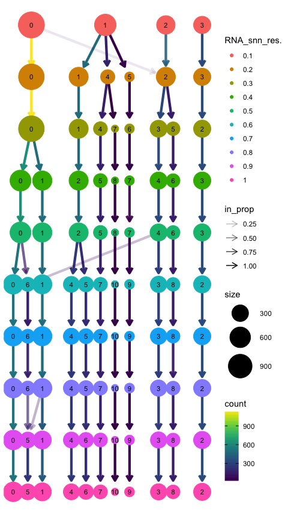<!-- -->

<!--
## With griph

A third R implementation of graph-based clustering is available in the
[_griph_](https://github.com/ppapasaikas/griph) package (which internally also
uses community detection algorithms from *[igraph](https://CRAN.R-project.org/package=igraph)*). The basic
outline of the griph algorithm is as follows:

* Sample a small but representative set of cells for initial calculations
* Select informative (highly variable) genes
* Calculate similarities among cells, by combining four metrics: Canberra
distance, Hellinger distance, Pearson correlation and Spearman correlation
* Estimate a sparse graph structure using the graphical lasso. In this step,
restrictions can be applied to adjust for batch effects, by effectively limiting
cells from the same batch from being directly connected
* Reweight edges to limit the impact of spurious structure caused by noise
* Identify communities using the Louvain algorithm
* Use the results from the representative set of cells to create a graph
reconstruction and community detection for the full set of cells

The input to griph is a matrix of _raw_ gene-level counts. Normalization and
gene selection is performed internally.


```r
library(griph)
clust_griph <- griph::griph_cluster(
  as.matrix(counts(sce)), K = 20, plot_ = TRUE, use.par = FALSE
)
sce$cluster_griph <- factor(clust_griph$MEMB)
scater::plotReducedDim(sce, "TSNE", colour_by = "cluster_griph")
```
-->

# K-means clustering

K-means is a generic clustering algorithm that has been used in many application
areas. In R, it can be applied via the `kmeans` function. Typically, it is
applied to a reduced dimension representation of the expression data (most often
PCA, because of the interpretability of the low-dimensional distances). We need
to define the number of clusters in advance. Since the results depend on the
initialization of the cluster centers, it is typically recommended to run
K-means with multiple starting configurations (via the `nstart` argument).


```r
set.seed(123)
clust_kmeans_k10 <- kmeans(reducedDim(sce, "PCA"), centers = 10, nstart = 25)
table(clust_kmeans_k10$cluster)
```

```
## 
##   1   2   3   4   5   6   7   8   9  10 
##  11 276 240 411 291 160 432 344 141 337
```

```r
sce$cluster_kmeans_k10 <- factor(clust_kmeans_k10$cluster)
plotReducedDim(sce, "TSNE", colour_by = "cluster_kmeans_k10")
```

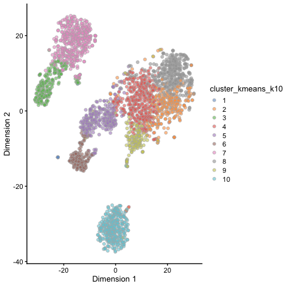<!-- -->

As we saw in the lecture, the gap statistic is one approach to compare
clusterings with different number of clusters. We set the number of random
starts to 5 and the number of bootstraps to 25, to reduce computational time.


```r
set.seed(123)
gaps <- cluster::clusGap(
  reducedDim(sce, "PCA"), kmeans, 
  K.max = 20, nstart = 5, B = 25
)

## Find the "best" k
best.k <- cluster::maxSE(gaps$Tab[, "gap"], gaps$Tab[, "SE.sim"])
best.k
```

```
## [1] 12
```

```r
ggplot(as.data.frame(gaps$Tab), aes(x = seq_along(gap), y = gap)) + 
  geom_point(size = 4) + geom_vline(xintercept = best.k, color = "red") + 
  theme_bw() + xlab("Number of clusters")
```

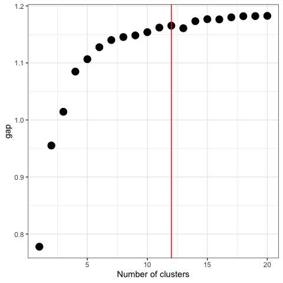<!-- -->

# Hierarchical clustering

Hierarchical clustering is another generic form of clustering that can be
applied also to scRNA-seq data. As K-means, it is typically applied to a reduced
dimension representation of the data. Hierarchical clustering returns an entire
hierarchy of partitionings (a dendrogram) that can be cut at different levels.


```r
## Calculate pairwise distances among cells
distsce <- dist(reducedDim(sce, "PCA"))
hcl <- hclust(distsce, method = "ward.D2")
plot(hcl, labels = FALSE)
```

<!-- -->

The choice of linkage method can have a large influence on the resulting
dendrogram. To illustrate this, we change the `method` argument of `hclust` and
compare the results.


```r
hcl_single <- hclust(distsce, method = "single")
plot(hcl_single, labels = FALSE)
```

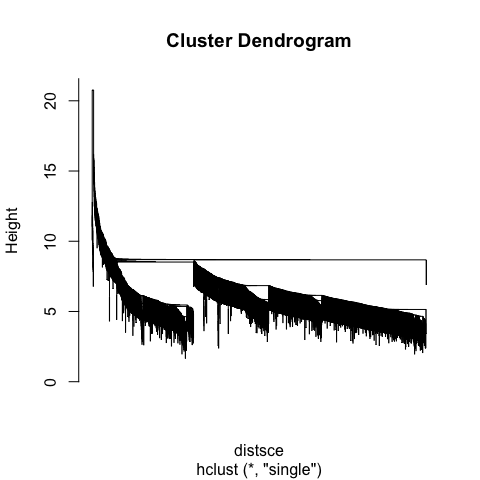<!-- -->

```r
hcl_complete <- hclust(distsce, method = "complete")
plot(hcl_complete, labels = FALSE)
```

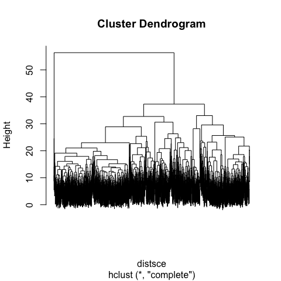<!-- -->

Given a dendrogram, it can be cut in different ways to create discrete clusters. 
The `cutree` function will cut it at a given height, determined either 
explicitly or implicitly (by providing the desired number of clusters).


```r
clust_hcl_k10 <- cutree(hcl, k = 10)
table(clust_hcl_k10)
```

```
## clust_hcl_k10
##   1   2   3   4   5   6   7   8   9  10 
## 330 340 220 118 331 205 143 635 310  11
```

```r
sce$cluster_hcl_k10 <- factor(clust_hcl_k10)
plotReducedDim(sce, "TSNE", colour_by = "cluster_hcl_k10")
```

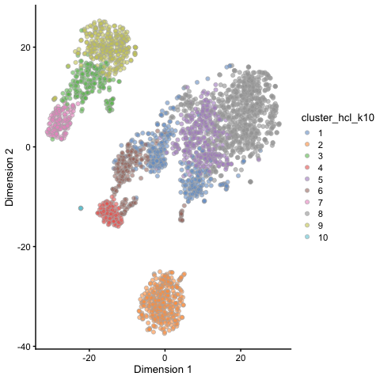<!-- -->

However, it is not always optimal to use a single cutoff for the entire
dendrogram. The *[dynamicTreeCut](https://CRAN.R-project.org/package=dynamicTreeCut)* package allows a dynamic cut,
which may be performed at different heights in different parts of the tree.


```r
clust_hcl_dyn <- dynamicTreeCut::cutreeDynamic(
  hcl, distM = as.matrix(distsce),
  minClusterSize = 10, deepSplit = 1
)
```

```
##  ..cutHeight not given, setting it to 573  ===>  99% of the (truncated) height range in dendro.
##  ..done.
```

```r
table(clust_hcl_dyn)
```

```
## clust_hcl_dyn
##   1   2   3   4   5   6   7   8 
## 661 635 530 340 205 143 118  11
```

```r
table(clust_hcl_k10, clust_hcl_dyn)
```

```
##              clust_hcl_dyn
## clust_hcl_k10   1   2   3   4   5   6   7   8
##            1  330   0   0   0   0   0   0   0
##            2    0   0   0 340   0   0   0   0
##            3    0   0 220   0   0   0   0   0
##            4    0   0   0   0   0   0 118   0
##            5  331   0   0   0   0   0   0   0
##            6    0   0   0   0 205   0   0   0
##            7    0   0   0   0   0 143   0   0
##            8    0 635   0   0   0   0   0   0
##            9    0   0 310   0   0   0   0   0
##            10   0   0   0   0   0   0   0  11
```

```r
sce$cluster_hcl_dyn <- factor(clust_hcl_dyn)
plotReducedDim(sce, "TSNE", colour_by = "cluster_hcl_dyn")
```

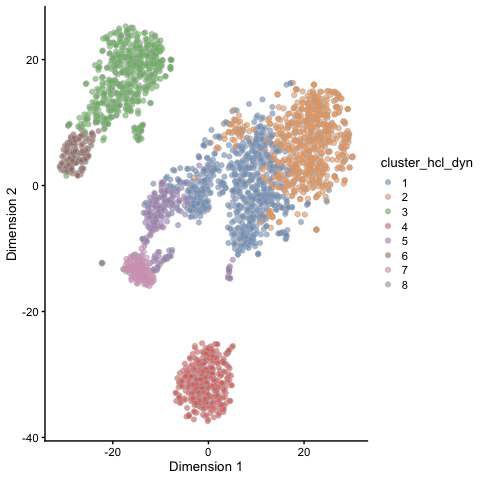<!-- -->

Clustering methods can also be combined, e.g., by first applying K-means to
cluster the cells into a relatively large number of clusters, and then use
hierarchical clustering to cluster the resulting cluster centroids, with the aim
of finding associations among the original K-means clusters.


```r
set.seed(123)
clust_kmeans_k20 <- kmeans(reducedDim(sce, "PCA"), centers = 20)
sce$cluster_kmeans_k20 <- factor(clust_kmeans_k20$cluster)
plotReducedDim(sce, "TSNE", colour_by = "cluster_kmeans_k20")
```

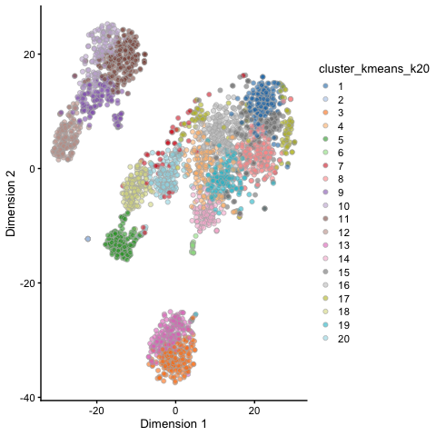<!-- -->

```r
centroid_tree <- hclust(dist(clust_kmeans_k20$centers), method = "ward.D2")
plot(centroid_tree)
```

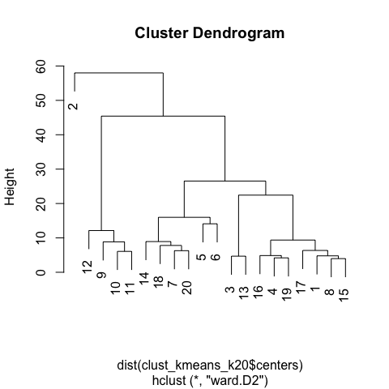<!-- -->

# SC3

The final method we will try is implemented in the *[SC3](https://bioconductor.org/packages/3.9/SC3)* package.
As we saw in the lecture, SC3 performs multiple clusterings, based on different
dissimilarity metrics and data representations, and returns a consensus
partitioning of the cells. Since SC3 currently runs quite slowly with large data
sets, we generate a subset of the original data, containing 300 randomly
selected cells. In addition, SC3 assumes that there is a column named
`feature_symbol` in the `rowData` of the SingleCellExperiment object, and thus
we'll add that as well.


```r
## Subsample cells
scesub <- sce[, sample(seq_len(ncol(sce)), 300)]

## Add feature_symbol column
rowData(scesub)$feature_symbol <- rownames(scesub)

## Convert sparse count matrix to regular matrix
counts(scesub) <- as.matrix(counts(scesub))
```

Next, we run the `sc3` wrapper function, specifying the number of clusters that
we would like to try (with the `ks` argument). Note that this will take a few
minutes to run.


```r
scesub <- SC3::sc3(scesub, ks = 10:12, biology = TRUE, n_cores = 1)
```

```
## Setting SC3 parameters...
```

```
## Calculating distances between the cells...
```

```
## Performing transformations and calculating eigenvectors...
```

```
## Performing k-means clustering...
```

```
## Calculating consensus matrix...
```

```
## Calculating biology...
```

The results of the clustering are added to the `colData` slot of the
SingleCellExperiment object.


```r
head(colData(scesub)[, grep("sc3_", colnames(colData(scesub)))])
```

```
## DataFrame with 6 rows and 6 columns
##          sc3_10_clusters sc3_11_clusters sc3_12_clusters
##                 <factor>        <factor>        <factor>
## Cell2624               4               7               8
## Cell1479              10               5               6
## Cell1707               2               2               2
## Cell1826              10               5               6
## Cell218                6               8              10
## Cell1648               4               7               8
##          sc3_10_log2_outlier_score sc3_11_log2_outlier_score
##                          <numeric>                 <numeric>
## Cell2624                         0                         0
## Cell1479                         0                         0
## Cell1707                         0                         0
## Cell1826                         0                         0
## Cell218                          0          1.84140861242728
## Cell1648                         0                         0
##          sc3_12_log2_outlier_score
##                          <numeric>
## Cell2624                         0
## Cell1479                         0
## Cell1707                         0
## Cell1826                         0
## Cell218           4.32025409559709
## Cell1648                         0
```

*[SC3](https://bioconductor.org/packages/3.9/SC3)* contains several functions for exploring and visualizing the
clustering results. For example, we can plot the consensus matrix and add
annotations for the rows and columns. The 'outlier score' is an indication of
how different a cell is from all other cells in the same cluster.


```r
SC3::sc3_plot_consensus(
    scesub, k = 10, 
    show_pdata = c(
        "sc3_10_clusters", 
        "sc3_10_log2_outlier_score"
    )
)
```

<!-- -->

We can also plot the silhouette scores, as well as summarized expression levels
across the cells.


```r
SC3::sc3_plot_silhouette(scesub, k = 10)
```

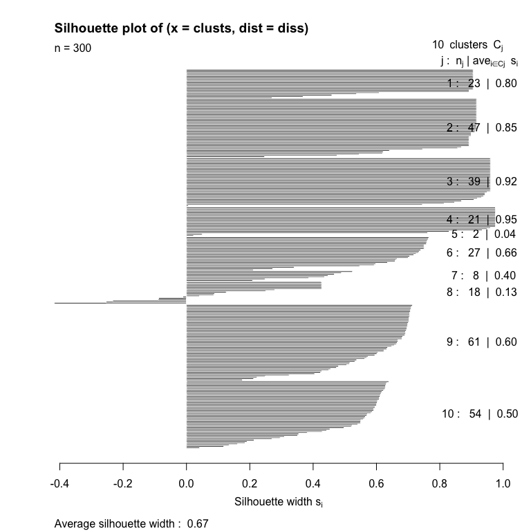<!-- -->

```r
SC3::sc3_plot_expression(
    scesub, k = 10, 
    show_pdata = c(
        "sc3_10_clusters", 
        "sc3_10_log2_outlier_score"
    )
)
```

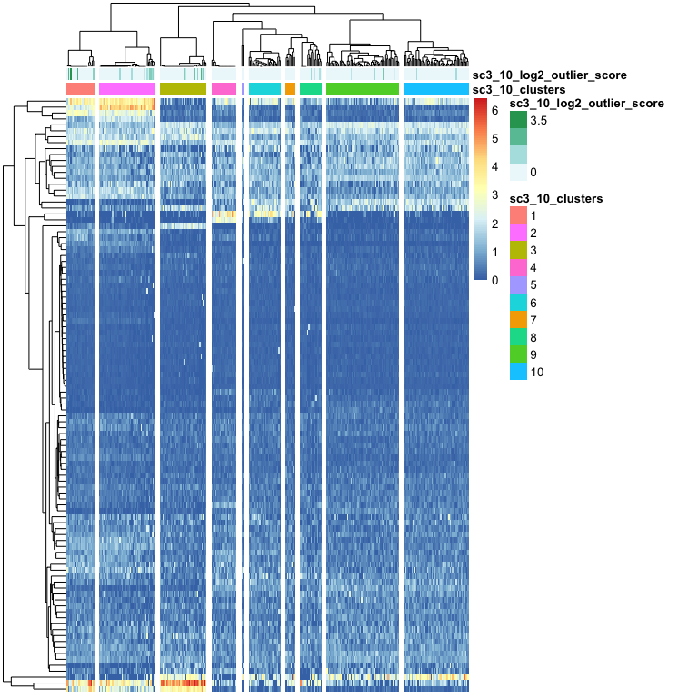<!-- -->

Finally, *[SC3](https://bioconductor.org/packages/3.9/SC3)* also returns "differentially expressed genes" as
well as "marker genes". Differentially expressed genes are obtained via the
Kruskal-Wallis test, comparing all the clusters. Marker genes, on the other
hand, are obtained by building a binary classifier from the expression levels of
each gene, attempting to discriminate one cluster from the other cells. The area
under the ROC curve is used to quantify the accuracy of the prediction. In
addition, the Wilcoxon test is used to assign a p-value to each gene. This
information is stored in the `rowData` slot of the SingleCellExperiment object,
and can be visualized as well. Check the help pages for the respective functions
to see how the genes to show are selected.


```r
head(rowData(scesub)[rowData(scesub)$sc3_gene_filter, 
                     grep("sc3_", colnames(rowData(scesub)))])
```

```
## DataFrame with 6 rows and 13 columns
##          sc3_gene_filter sc3_10_markers_clusts sc3_10_markers_padj
##                <logical>             <numeric>           <numeric>
## ISG15               TRUE                     5                   1
## SDF4                TRUE                     4                   1
## AURKAIP1            TRUE                     1                   1
## MRPL20              TRUE                     4                   1
## SSU72               TRUE                     2                   1
## C1orf86             TRUE                     7                   1
##          sc3_10_markers_auroc sc3_11_markers_clusts  sc3_11_markers_padj
##                     <numeric>             <numeric>            <numeric>
## ISG15       0.894295302013423                     1 0.000829654398414359
## SDF4        0.610513739545998                     4                    1
## AURKAIP1    0.582954010359441                     4                    1
## MRPL20      0.594982078853047                     7                    1
## SSU72       0.557774787654529                    11                    1
## C1orf86     0.682791095890411                     4                    1
##          sc3_11_markers_auroc sc3_12_markers_clusts sc3_12_markers_padj
##                     <numeric>             <numeric>           <numeric>
## ISG15       0.779626432271229                     1  0.0324366944851965
## SDF4        0.882943143812709                     5                   1
## AURKAIP1    0.712374581939799                     5                   1
## MRPL20      0.594982078853047                     8                   1
## SSU72       0.611041207927021                     4                   1
## C1orf86     0.836120401337793                     5                   1
##          sc3_12_markers_auroc       sc3_10_de_padj       sc3_11_de_padj
##                     <numeric>            <numeric>            <numeric>
## ISG15       0.766154452324665 2.01879757349275e-06 1.37433818520784e-05
## SDF4        0.882943143812709                    1                    1
## AURKAIP1    0.712374581939799                    1                    1
## MRPL20      0.594982078853047                    1                    1
## SSU72       0.657516891891892                    1                    1
## C1orf86     0.836120401337793                    1                    1
##               sc3_12_de_padj
##                    <numeric>
## ISG15    0.00034251832278301
## SDF4                       1
## AURKAIP1                   1
## MRPL20                     1
## SSU72                      1
## C1orf86                    1
```

```r
SC3::sc3_plot_de_genes(scesub, k = 10)
```

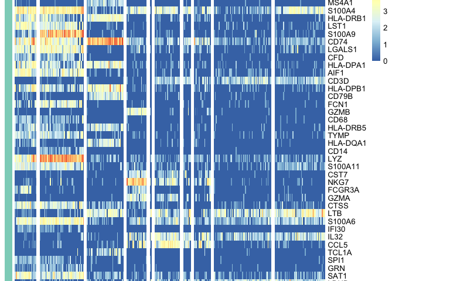<!-- -->

```r
SC3::sc3_plot_markers(scesub, k = 10)
```

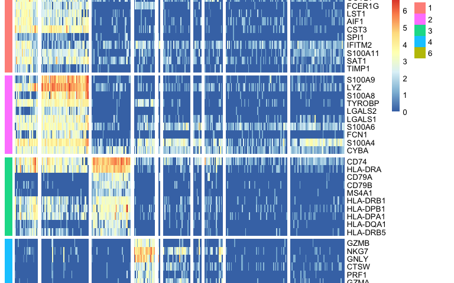<!-- -->


# Session info


```r
sessionInfo()
```

```
## R version 3.6.1 (2019-07-05)
## Platform: x86_64-apple-darwin15.6.0 (64-bit)
## Running under: macOS High Sierra 10.13.6
## 
## Matrix products: default
## BLAS:   /Library/Frameworks/R.framework/Versions/3.6/Resources/lib/libRblas.0.dylib
## LAPACK: /Library/Frameworks/R.framework/Versions/3.6/Resources/lib/libRlapack.dylib
## 
## locale:
## [1] en_US.UTF-8/en_US.UTF-8/en_US.UTF-8/C/en_US.UTF-8/en_US.UTF-8
## 
## attached base packages:
## [1] parallel  stats4    stats     graphics  grDevices utils     datasets 
## [8] methods   base     
## 
## other attached packages:
##  [1] igraph_1.2.4.1              dynamicTreeCut_1.63-1      
##  [3] Seurat_3.1.1                cluster_2.1.0              
##  [5] pheatmap_1.0.12             mclust_5.4.5               
##  [7] clustree_0.4.1              ggraph_2.0.0               
##  [9] SC3_1.12.0                  BiocSingular_1.0.0         
## [11] scran_1.12.1                scater_1.12.2              
## [13] ggplot2_3.2.1               TENxPBMCData_1.2.0         
## [15] HDF5Array_1.12.2            rhdf5_2.28.1               
## [17] SingleCellExperiment_1.6.0  SummarizedExperiment_1.14.1
## [19] DelayedArray_0.10.0         BiocParallel_1.18.1        
## [21] matrixStats_0.55.0          Biobase_2.44.0             
## [23] GenomicRanges_1.36.1        GenomeInfoDb_1.20.0        
## [25] IRanges_2.18.3              S4Vectors_0.22.1           
## [27] BiocGenerics_0.30.0         BiocStyle_2.12.0           
## 
## loaded via a namespace (and not attached):
##   [1] reticulate_1.13               R.utils_2.9.0                
##   [3] tidyselect_0.2.5              htmlwidgets_1.5.1            
##   [5] RSQLite_2.1.2                 AnnotationDbi_1.46.1         
##   [7] grid_3.6.1                    Rtsne_0.15                   
##   [9] munsell_0.5.0                 codetools_0.2-16             
##  [11] ica_1.0-2                     statmod_1.4.32               
##  [13] future_1.14.0                 withr_2.1.2                  
##  [15] colorspace_1.4-1              knitr_1.25                   
##  [17] ROCR_1.0-7                    robustbase_0.93-5            
##  [19] gbRd_0.4-11                   listenv_0.7.0                
##  [21] labeling_0.3                  Rdpack_0.11-0                
##  [23] GenomeInfoDbData_1.2.1        polyclip_1.10-0              
##  [25] bit64_0.9-7                   farver_1.1.0                 
##  [27] vctrs_0.2.0                   xfun_0.10                    
##  [29] BiocFileCache_1.8.0           R6_2.4.0                     
##  [31] doParallel_1.0.15             ggbeeswarm_0.6.0             
##  [33] graphlayouts_0.5.0            rsvd_1.0.2                   
##  [35] locfit_1.5-9.1                bitops_1.0-6                 
##  [37] assertthat_0.2.1              promises_1.1.0               
##  [39] SDMTools_1.1-221.1            scales_1.0.0                 
##  [41] beeswarm_0.2.3                gtable_0.3.0                 
##  [43] beachmat_2.0.0                npsurv_0.4-0                 
##  [45] globals_0.12.4                tidygraph_1.1.2              
##  [47] rlang_0.4.0                   zeallot_0.1.0                
##  [49] splines_3.6.1                 lazyeval_0.2.2               
##  [51] checkmate_1.9.4               reshape2_1.4.3               
##  [53] BiocManager_1.30.7            yaml_2.2.0                   
##  [55] backports_1.1.5               httpuv_1.5.2                 
##  [57] tools_3.6.1                   gplots_3.0.1.1               
##  [59] RColorBrewer_1.1-2            ggridges_0.5.1               
##  [61] Rcpp_1.0.2                    plyr_1.8.4                   
##  [63] zlibbioc_1.30.0               purrr_0.3.2                  
##  [65] RCurl_1.95-4.12               pbapply_1.4-2                
##  [67] viridis_0.5.1                 cowplot_1.0.0                
##  [69] zoo_1.8-6                     ggrepel_0.8.1                
##  [71] magrittr_1.5                  data.table_1.12.4            
##  [73] lmtest_0.9-37                 RANN_2.6.1                   
##  [75] mvtnorm_1.0-11                fitdistrplus_1.0-14          
##  [77] lsei_1.2-0                    mime_0.7                     
##  [79] evaluate_0.14                 xtable_1.8-4                 
##  [81] gridExtra_2.3                 compiler_3.6.1               
##  [83] tibble_2.1.3                  KernSmooth_2.23-15           
##  [85] crayon_1.3.4                  R.oo_1.22.0                  
##  [87] htmltools_0.4.0               pcaPP_1.9-73                 
##  [89] later_1.0.0                   tidyr_1.0.0                  
##  [91] rrcov_1.4-7                   RcppParallel_4.4.4           
##  [93] DBI_1.0.0                     tweenr_1.0.1                 
##  [95] ExperimentHub_1.10.0          WriteXLS_5.0.0               
##  [97] dbplyr_1.4.2                  MASS_7.3-51.4                
##  [99] rappdirs_0.3.1                Matrix_1.2-17                
## [101] R.methodsS3_1.7.1             gdata_2.18.0                 
## [103] metap_1.1                     pkgconfig_2.0.3              
## [105] registry_0.5-1                plotly_4.9.0                 
## [107] foreach_1.4.7                 vipor_0.4.5                  
## [109] dqrng_0.2.1                   rngtools_1.4                 
## [111] pkgmaker_0.27                 XVector_0.24.0               
## [113] bibtex_0.4.2                  doRNG_1.7.1                  
## [115] stringr_1.4.0                 digest_0.6.21                
## [117] tsne_0.1-3                    sctransform_0.2.0            
## [119] RcppAnnoy_0.0.13              leiden_0.3.1                 
## [121] rmarkdown_1.16                uwot_0.1.4                   
## [123] edgeR_3.26.8                  DelayedMatrixStats_1.6.1     
## [125] curl_4.2                      shiny_1.4.0                  
## [127] gtools_3.8.1                  jsonlite_1.6                 
## [129] lifecycle_0.1.0               nlme_3.1-141                 
## [131] Rhdf5lib_1.6.2                BiocNeighbors_1.2.0          
## [133] viridisLite_0.3.0             limma_3.40.6                 
## [135] pillar_1.4.2                  lattice_0.20-38              
## [137] fastmap_1.0.1                 httr_1.4.1                   
## [139] DEoptimR_1.0-8                survival_2.44-1.1            
## [141] interactiveDisplayBase_1.22.0 glue_1.3.1                   
## [143] png_0.1-7                     iterators_1.0.12             
## [145] bit_1.1-14                    ggforce_0.3.1                
## [147] class_7.3-15                  stringi_1.4.3                
## [149] blob_1.2.0                    AnnotationHub_2.16.1         
## [151] caTools_1.17.1.2              memoise_1.1.0                
## [153] dplyr_0.8.3                   irlba_2.3.3                  
## [155] e1071_1.7-2                   future.apply_1.3.0           
## [157] ape_5.3
```

# References
