# Introduction

This lab covers some of the most commonly used methods for finding
differentially expressed genes ("marker genes") between clusters in single-cell
RNA-seq. For most of the lab, we will use an example data set consisting of
2,700 PBMCs, sequenced using 10x Genomics technology and provided via the 
*[TENxPBMCData](https://bioconductor.org/packages/3.9/TENxPBMCData)* package.

First, a cautionary note: some care should be taken when interpreting the
p-values from *any* statistical test applied in this context, since the testing is
performed on the _same_ data that is used to extract the clusters in the first
place. Thus, almost by construction, there will be some genes that are
differentially expressed between the different clusters.

Many parts of this tutorial are taken from, or inspired by, the online book
["Orchestrating single-cell analysis with
Bioconductor"](https://osca.bioconductor.org/), which is also an excellent
resource for additional discussions on many of the steps performed here.

# Load packages

We first load the required R packages. 


```r
suppressPackageStartupMessages({
  library(SummarizedExperiment)
  library(SingleCellExperiment)
  library(TENxPBMCData)
  library(scater)
  library(scran)
  library(BiocSingular)
  library(pheatmap)
  library(Seurat)
  library(igraph)
  library(ggplot2)
  library(limma)
  library(edgeR)
})
```

# Load and preprocess data

Next, we load the data (from the *[TENxPBMCData](https://bioconductor.org/packages/3.9/TENxPBMCData)* package), calculate
QC metrics with *[scater](https://bioconductor.org/packages/3.9/scater)*, normalize and run denoising PCA with 
*[scran](https://bioconductor.org/packages/3.9/scran)* and apply tSNE using *[scater](https://bioconductor.org/packages/3.9/scater)*, as we have seen
previously in the course. We also apply a graph-based community detection
algorithm in order to partition the cells into discrete clusters.


```r
## Load data
sce <- TENxPBMCData::TENxPBMCData(dataset = "pbmc3k")
```

```
## snapshotDate(): 2019-04-29
```

```
## see ?TENxPBMCData and browseVignettes('TENxPBMCData') for documentation
```

```
## downloading 0 resources
```

```
## loading from cache 
##     'EH1607 : 1607'
```

```r
## Add column names, and use gene symbol as row names wherever possible
colnames(sce) <- paste0("Cell", seq_len(ncol(sce)))
rownames(sce) <- scater::uniquifyFeatureNames(
    ID = rowData(sce)$ENSEMBL_ID,
    names = rowData(sce)$Symbol_TENx
)

## Calculate QC metrics and remove cells with more than 5% reads from
## mitochondrial genes
MT <- rownames(sce)[grep("^MT-", rownames(sce))]
sce <- scater::calculateQCMetrics(
  object = sce, 
  feature_controls = list(MT = MT)
)
sce <- sce[, sce$pct_counts_MT < 5]

## Calculate size factors and normalize
## Note that the pre-clustering step has been excluded to save computational
## time
sce <- scran::computeSumFactors(sce, min.mean = 0.1)
sce <- scater::normalize(sce)
logcounts(sce) <- as.matrix(logcounts(sce))

## Fit variance trend and apply denoising PCA
new.trend <- scran::makeTechTrend(x = sce)
fit <- scran::trendVar(sce, use.spikes = FALSE, loess.args = list(span = 0.05))
fit$trend <- new.trend
dec <- scran::decomposeVar(fit = fit)
set.seed(123)
sce <- scran::denoisePCA(sce, technical = new.trend, BSPARAM = IrlbaParam())

## Apply tSNE
set.seed(123)
sce <- scater::runTSNE(sce, use_dimred = "PCA", perplexity = 30)

## Cluster
graph_k10 <- scran::buildSNNGraph(sce, k = 10, use.dimred = "PCA", type = "rank")
clust_k10_louvain <- igraph::cluster_louvain(graph_k10)$membership
sce$cluster_louvain_k10 <- factor(clust_k10_louvain)
scater::plotReducedDim(sce, "TSNE", colour_by = "cluster_louvain_k10")
```

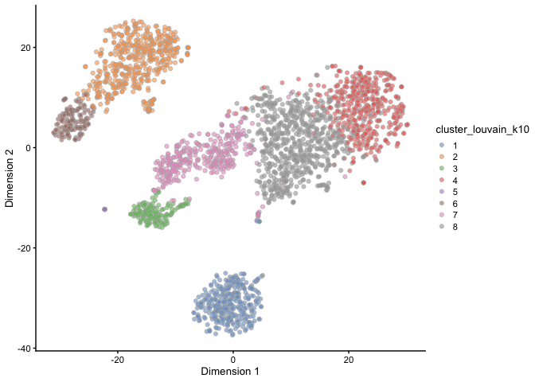<!-- -->

```r
## Create Seurat object, calculate centered and scaled data, and assign identity labels
so <- Seurat::as.Seurat(sce)
```

```
## Warning: Feature names cannot have underscores ('_'), replacing with dashes
## ('-')

## Warning: Feature names cannot have underscores ('_'), replacing with dashes
## ('-')
```

```r
so <- Seurat::ScaleData(so)
```

```
## Centering and scaling data matrix
```

```r
Seurat::Idents(so) <- "cluster_louvain_k10"
Seurat::DimPlot(so)
```

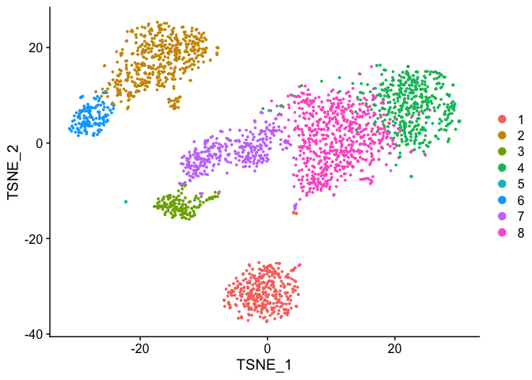<!-- -->

# Pairwise t-tests with scran

The t-test is a natural choice for comparing observed expression levels in two
groups (e.g., clusters). It has been shown to be competitive also in terms of
performance on various types of scRNA-seq data [@Soneson2018-hg]. 

The *[scran](https://bioconductor.org/packages/3.9/scran)* package contains a function named `pairwiseTTests`,
which will, as the name suggests, perform a t-test between each pair of
clusters. The input is a matrix of normalized, log-transformed expression
values, and a vector of cluster labels. The output of this function call is a
list with two elements: `statistics` and `pairs`. Each element of `statistics`
is a `DataFrame` giving the results of the applied test for a given pair of
clusters (the corresponding pair is obtained from the `pairs` object). The
`direction` argument specifies whether we are interested in genes regulated in
any direction, or only up- or down-regulated genes, respectively.


```r
pwtt <- scran::pairwiseTTests(
  x = logcounts(sce), clusters = sce$cluster_louvain_k10, 
  direction = "up"
)
names(pwtt)
```

```
## [1] "statistics" "pairs"
```

```r
length(pwtt$statistics)  ## number of pairs
```

```
## [1] 56
```

```r
head(pwtt$statistics[[1]])  ## results from first pairwise test
```

```
## DataFrame with 6 rows and 3 columns
##                            logFC           p.value               FDR
##                        <numeric>         <numeric>         <numeric>
## MIR1302-10                     0               0.5 0.628513285209645
## FAM138A                        0               0.5 0.628513285209645
## OR4F5                          0               0.5 0.628513285209645
## RP11-34P13.7                   0               0.5 0.628513285209645
## RP11-34P13.8                   0               0.5 0.628513285209645
## AL627309.1   -0.0105216392240283 0.992189836786874                 1
```

```r
head(pwtt$pairs)  ## clusters compared in each pair
```

```
## DataFrame with 6 rows and 2 columns
##         first      second
##   <character> <character>
## 1           1           2
## 2           1           3
## 3           1           4
## 4           1           5
## 5           1           6
## 6           1           7
```

While the `pairwiseTTests` function (and the similar `pairwiseWilcox` function
for the Wilcoxon test) provides a very convenient and efficient way of
performing all pairwise comparisons, in practice we often want to summarize or
combine the results across several of these comparisons. For example, as
discussed in the lecture we may be interested in finding genes that are
upregulated in a specific cluster compared to _each_ of the other clusters, or
compared to _at least one_ of them. The function `combineMarkers` from 
*[scran](https://bioconductor.org/packages/3.9/scran)* was written for this purpose, and allows the user to combine
the list of pairwise results in several ways. For example, in order to test, for
each cluster, whether each gene is significantly upregulated with respect to
_all_ other clusters, we can do:


```r
cbm_all <- scran::combineMarkers(
  de.lists = pwtt$statistics, pairs = pwtt$pairs,
  pval.type = "all"
)
```

The result of this function call is a list, containing one `DataFrame` for each
original cluster. This `DataFrame` contains, in addition to the logFCs compared
to each of the other clusters, a nominal and an adjusted p-value testing the
hypothesis that the gene is not DE in all the contrasts involving the cluster of
interest. Thus, the top-ranked markers for a given cluster can be seen as
"specific" marker genes for that cluster.

It is often helpful from an interpretation point of view to explore the detected
marker genes visually. *[scater](https://bioconductor.org/packages/3.9/scater)* contains many useful functions for
creating such static plots, and other packages like *[iSEE](https://bioconductor.org/packages/3.9/iSEE)* can be
used for interactive exploration. Here, we illustrate how to show the expression
of marker genes across cells in the various clusters, as well as on top of a
reduced dimension representation. We also make a heatmap showing the expression
levels of the top two marker genes for each cluster.


```r
head(cbm_all[["1"]])
```

```
## DataFrame with 6 rows and 9 columns
##                        p.value                   FDR          logFC.2
##                      <numeric>             <numeric>        <numeric>
## CD79A     3.3190561047356e-142 1.08659258756834e-137 2.35557326358361
## MS4A1    3.08651711496327e-107 5.05231986548338e-103  1.6663480647261
## HLA-DQA1   1.0427204953384e-84  1.13788611921295e-80 1.60367234149279
## HLA-DQB1  2.26445030902514e-81  1.85333935542162e-77 1.49101166571617
## CD79B     2.23429182778861e-65  1.46292491716287e-61 2.14478590017022
## TCL1A     1.37016132988962e-60  7.47605693632107e-57 1.46567686351608
##                   logFC.3          logFC.4          logFC.5
##                 <numeric>        <numeric>        <numeric>
## CD79A    2.36612083495443 2.35360763461179 2.40073057115308
## MS4A1    1.66256780678052 1.66537776215393 1.71964644475809
## HLA-DQA1 2.01654033230337 2.02198525632341 2.03708666776726
## HLA-DQB1 1.92439913482696 1.92740262447046 1.95061385525677
## CD79B    2.00712711245984 2.15134534945958 2.23644752721825
## TCL1A    1.46229308367032 1.46591291364072 1.48601812710287
##                   logFC.6          logFC.7          logFC.8
##                 <numeric>        <numeric>        <numeric>
## CD79A    2.36025576047181 2.36462864060122  2.3412515575602
## MS4A1    1.66006652931437 1.65753993805618 1.67340652836628
## HLA-DQA1 1.65461163239192 1.90434134620464 2.00463315696893
## HLA-DQB1 1.73256493337886 1.83936394725109 1.84588973137353
## CD79B    1.56822861254966 2.09504508968842 2.10951323685953
## TCL1A    1.44989129047721 1.46393470051825  1.4545892602665
```

```r
scater::plotExpression(sce, features = c("CD79A", "MS4A1"), 
                       x = "cluster_louvain_k10")
```

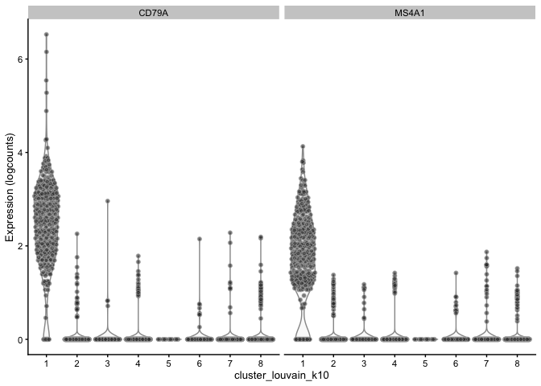<!-- -->

```r
cowplot::plot_grid(scater::plotTSNE(sce, colour_by = "CD79A"),
                   scater::plotTSNE(sce, colour_by = "MS4A1"))
```

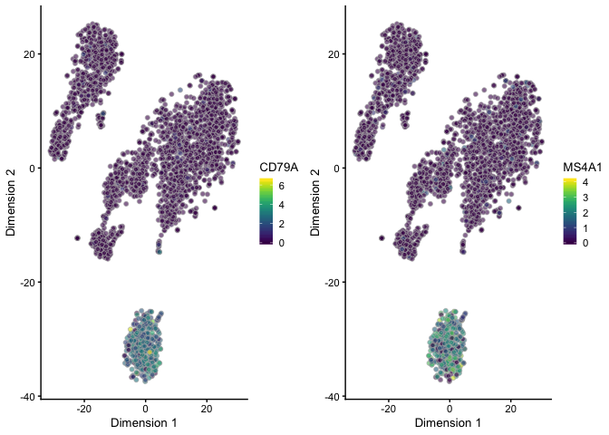<!-- -->

```r
scater::plotHeatmap(sce, features = unique(unlist(lapply(cbm_all, function(w) rownames(w)[1:2]))),
                    columns = colnames(sce)[order(sce$cluster_louvain_k10)],
                    colour_columns_by = "cluster_louvain_k10", cluster_cols = FALSE,
                    show_colnames = FALSE, cluster_rows = FALSE)
```

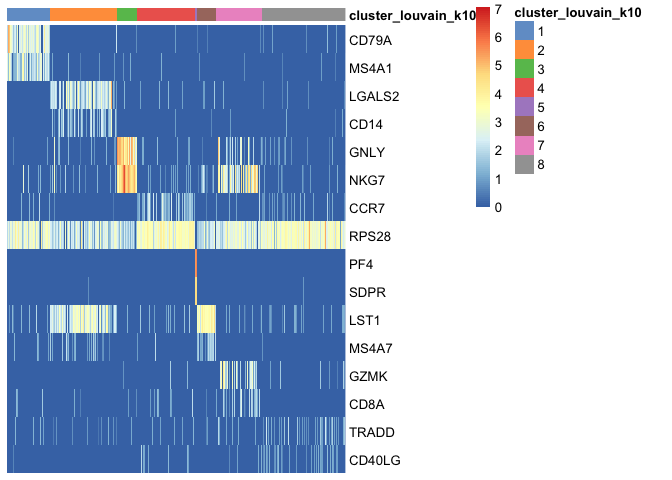<!-- -->

It is worth pointing out that in practice, we do not need to go through the two
individual steps above (first doing all pairwise tests, and then combining the
results). The `findMarkers` function from *[scran](https://bioconductor.org/packages/3.9/scran)* will do this for
us, given a specification of how we wish to combine the results across
contrasts. To illustrate this, we instead search for genes that are upregulated
in a cluster compared to _any_ of the other clusters (i.e., testing the null
hypothesis that the gene is not DE in any of the contrasts).


```r
cbm_any <- scran::findMarkers(
  sce, clusters = sce$cluster_louvain_k10, 
  pval.type = "any", direction = "up"
)
```

Again, the output of the above command is a list of `DataFrame`s, one for each
cluster. Each `DataFrame` contains the logFC with respect to each other cluster,
and a nominal and an adjusted p-value. There is also a column named `Top`, which
gives the minimum rank for the gene across all pairwise comparisons. For
example, if `Top` = 1, the gene is the top-ranked one in at least one comparison
of the cluster of interest to the other clusters.

To illustrate the difference between the two types of tests, we plot the
p-values obtained when comparing cluster 1 to the other clusters with the two
approaches.


```r
## p-values for the pval.type = "all" comparison
df_all <- as.data.frame(cbm_all[["1"]]) %>% 
  tibble::rownames_to_column("gene") %>% 
  dplyr::select(gene, p.value) %>% 
  setNames(c("gene", "p.value.all"))

## p-values for the pval.type = "any" comparison
df_any <- as.data.frame(cbm_any[["1"]]) %>% 
  tibble::rownames_to_column("gene") %>%
  dplyr::select(gene, p.value) %>%
  setNames(c("gene", "p.value.any"))

## Merge and plot
df <- dplyr::inner_join(df_all, df_any, by = "gene")
ggplot(df, aes(x = p.value.all, y = p.value.any)) + 
  geom_point() + scale_x_log10() + scale_y_log10() + 
  theme_bw()
```

```
## Warning: Transformation introduced infinite values in continuous y-axis
```

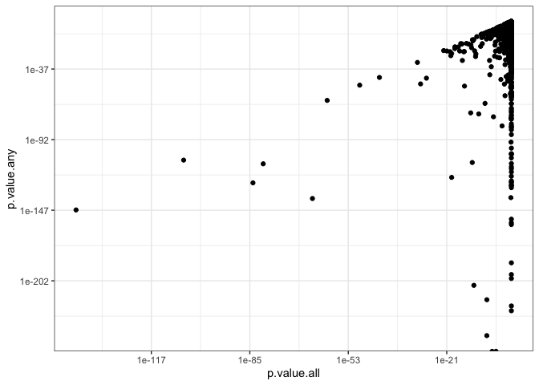<!-- -->

We see that while there are many genes that are strongly significant in both
types of analyses, there are other genes that are only strongly significant with
`pval.type = "any"`. We look at one of the genes that are among the top-ranked
ones in both types of comparisons, and one of the genes that is top-ranked only
in the `"any"` approach.


```r
genes <- c("CD79A", "RPS16")
subset(df, gene %in% genes)
```

```
##        gene   p.value.all   p.value.any
## 1     CD79A 3.319056e-142 1.667423e-147
## 32223 RPS16  1.000000e+00 4.692708e-226
```

```r
scater::plotExpression(sce, features = genes, x = "cluster_louvain_k10")
```

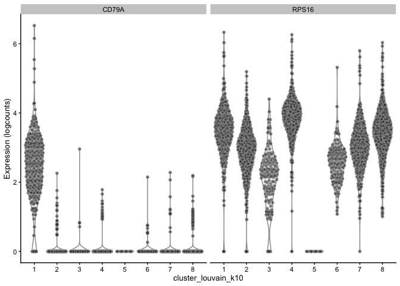<!-- -->

Note the difference between a gene that is upregulated in cluster 1 compared to
_all_ other clusters, and one that is upregulated to _at least one_ other
cluster.

While `pval.type = "all"` will, as just illustrated, allow us to detect marker
genes that are specific to a given cluster, there are important pitfalls to be
aware of. In order to illustrate one of these, we artifically split the cells in
cluster 1 into two clusters (call one of the groups "1b"), and redo the test to
find genes that are upregulated in cluster 1 compared to _all_ other clusters.


```r
tmp <- as.character(sce$cluster_louvain_k10)
set.seed(123)
tmp[sample(which(tmp == "1"), sum(tmp == "1")/2)] <- "1b"
sce$cluster_louvain_k10_mod <- factor(tmp)
cbm_all_mod <- scran::findMarkers(
  sce, clusters = sce$cluster_louvain_k10_mod,
  pval.type = "all"
)
cbm_all_mod[["1"]]["CD79A", ]
```

```
## DataFrame with 1 row and 10 columns
##                 p.value       FDR          logFC.1b          logFC.2
##               <numeric> <numeric>         <numeric>        <numeric>
## CD79A 0.239192177710566         1 0.128979125560312 2.42006282636377
##                logFC.3          logFC.4          logFC.5          logFC.6
##              <numeric>        <numeric>        <numeric>        <numeric>
## CD79A 2.43061039773459 2.41809719739195 2.46522013393324 2.42474532325197
##                logFC.7          logFC.8
##              <numeric>        <numeric>
## CD79A 2.42911820338138 2.40574112034036
```

```r
scater::plotExpression(sce, features = "CD79A", x = "cluster_louvain_k10_mod")
```

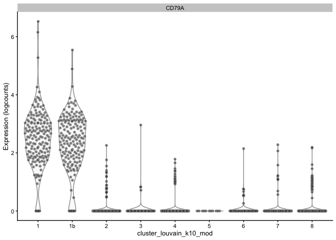<!-- -->

Note that now, the gene that was strongly upregulated in cluster 1 compared to
_all_ other clusters before, is no longer so, since it is expressed also in
cluster 1b. This is important to consider in cases where the data may be
overclustered, and thus there may be several clusters corresponding to the same
underlying cell type. This could also happen, for example, if clusters 1 and 1b
were different types of T-cells - no general T-cell markers would be upregulated
in any of these clusters compared to _all_ the other clusters.

**Note**: From the next release of Bioconductor (3.10, Oct/Nov 2019), the
`findMarkers` function provides an interface to several different types of tests. 
In addition to the default t-test, it is possible to perform Wilcoxon tests or
binomial tests (testing for differences in the presence/absence pattern of genes
between clusters) using the same interface, by specifying the `test` argument
(see https://osca.bioconductor.org/marker-gene-detection.html for an
illustration).

# Pairwise testing with any method

The `findMarkers` function can, as indicated above, perform t-tests, Wilcoxon
tests and binomial tests between each pair of clusters, and summarize the
results in various ways. If we prefer to use another method for statistical
testing (e.g., *[edgeR](https://bioconductor.org/packages/3.9/edgeR)*, *[DESeq2](https://bioconductor.org/packages/3.9/DESeq2)*, 
*[limma](https://bioconductor.org/packages/3.9/limma)*), we can manually do that for each pair of clusters, and use
the `combineMarkers` function to combine the results across comparisons. Here we
illustrate this approach using *[limma](https://bioconductor.org/packages/3.9/limma)* to perform the pairwise
tests. Note that *[limma](https://bioconductor.org/packages/3.9/limma)* is performing a two-sided test, while with
*[scran](https://bioconductor.org/packages/3.9/scran)* above, we indicated that we were only interested in
upregulated genes.


```r
## Set up the design matrix
design <- model.matrix(~ 0 + cluster_louvain_k10, data = colData(sce))
colnames(design) <- gsub("_louvain_k10", "", colnames(design))
colnames(design)
```

```
## [1] "cluster1" "cluster2" "cluster3" "cluster4" "cluster5" "cluster6"
## [7] "cluster7" "cluster8"
```

```r
## Remove some very lowly expressed genes
aveExpr <- scater::calculateAverage(sce)
keep <- aveExpr > 0.1 
summary(keep)
```

```
##    Mode   FALSE    TRUE 
## logical   30296    2442
```

```r
## Convert to DGEList, calculate logCPMs
dge <- scran::convertTo(sce, type = "edgeR", subset.row = keep)
y <- new("EList")
y$E <- edgeR::cpm(dge, log = TRUE, prior.count = 3)
fit <- limma::lmFit(y, design)

## Perform pairwise comparisons
nclust <- length(unique(sce$cluster_louvain_k10))
all.results <- all.pairs <- list()
counter <- 1L

for (i in seq_len(nclust)) {
    for (j in seq_len(i - 1L)) {
        con <- integer(ncol(design))
        con[i] <- 1
        con[j] <- -1
        fit2 <- limma::contrasts.fit(fit, con)
        fit2 <- limma::eBayes(fit2, trend = TRUE, robust = TRUE)

        res <- limma::topTable(fit2, number = Inf, sort.by = "none")
        all.results[[counter]] <- res
        all.pairs[[counter]] <- colnames(design)[c(i, j)]
        counter <- counter + 1L

        ## Also filling the reverse comparison.
        res$logFC <- -res$logFC
        all.results[[counter]] <- res
        all.pairs[[counter]] <- colnames(design)[c(j, i)]
        counter <- counter + 1L
    }
}

## Combine results across all pairwise tests
all.pairs <- do.call(rbind, all.pairs)
combined <- scran::combineMarkers(all.results, all.pairs, 
                                  pval.field = "P.Value",
                                  pval.type = "any")
head(combined[["cluster1"]])
```

```
## DataFrame with 6 rows and 10 columns
##              Top   p.value       FDR       logFC.cluster2
##        <integer> <numeric> <numeric>            <numeric>
## S100A9         1         0         0    -2.88054105221392
## FCER1G         1         0         0    -1.16074162950843
## GNLY           1         0         0   -0.018120409056392
## SDPR           1         0         0 -0.00476249202326073
## CD74           1         0         0     1.79005262332042
## S100A8         2         0         0    -2.23530574159961
##              logFC.cluster3       logFC.cluster4     logFC.cluster5
##                   <numeric>            <numeric>          <numeric>
## S100A9   0.0283203387900368   0.0237804357043601 -0.125662240463772
## FCER1G   -0.818134792313776  -0.0157045781669058 -0.194529095834872
## GNLY       -2.6836188555963 -0.00327404883774918 0.0434411881485826
## SDPR   -0.00882251901303555 -0.00567368947587532  -3.39909180902781
## CD74       3.01397559217413     3.19225717133351   2.94692648804481
## S100A8  0.00636477376163569  -0.0036268345197108 -0.164699560283198
##             logFC.cluster6       logFC.cluster7       logFC.cluster8
##                  <numeric>            <numeric>            <numeric>
## S100A9  -0.746421762967255  0.00940687301309495 -0.00132741094001965
## FCER1G   -1.92164876030226  -0.0130768128491301 -0.00116131042250522
## GNLY   0.00825087909522004   -0.328362607378743 -0.00182019508264553
## SDPR   -0.0307839922256878 -0.00889599789177531 -0.00238423942009192
## CD74      2.03353913071573     2.90285705653348     3.13999477842662
## S100A8  -0.274915015392811   0.0208579696175555 -0.00638501195459718
```


# Differential expression in the presence of batch effects

In the presence of strong batch effects (e.g., when cells come from different
studies or are prepared in multiple batches), these should be accounted for in
the differential expression analysis. One way of doing this is to use the
`block` argument of `findMarkers`, which effectively performs the cluster
comparisons in each batch, and subsequently combines the results into a single
p-value. Here, we illustrate this procedure using a data set of cells from three
different studies, each containing three different breast cell types. We first
load the data and add some reduced dimension representations for visualization
purposes.


```r
## Download the data and set row names to gene symbols whenever possible
bct <- readRDS(gzcon(url("https://github.com/NBISweden/single-cell_sib_scilifelab/blob/master/datasets/SCE_MammaryEpithelial_x3.rds?raw=true")))
rownames(bct) <- scater::uniquifyFeatureNames(
  ID = rownames(bct), 
  names = as.character(rowData(bct)$gene.symbols)
)

## Run PCA and tSNE (for later visualization purposes)
## The "study" column represents the blocking factor (the batch)
## The "cell.class" column contains the cell type information
bct <- scater::runPCA(bct, ncomponents = 30)
bct <- scater::runTSNE(bct, dimred = "PCA")
cowplot::plot_grid(plotTSNE(bct, colour_by = "study"),
                   plotTSNE(bct, colour_by = "cell.class"))
```

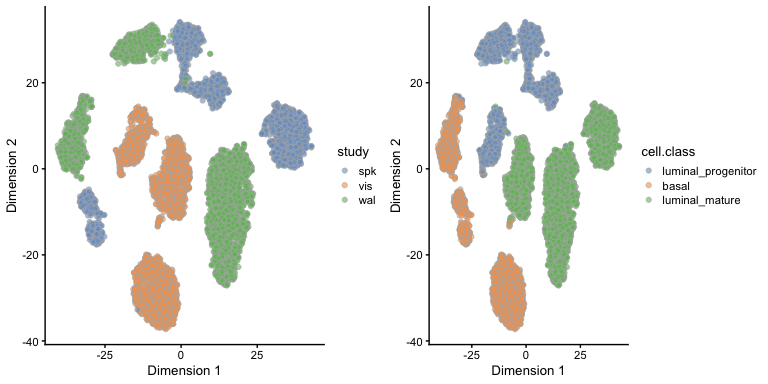<!-- -->

Next, we find marker genes, first considering all cells together (without
accounting for the batches) and second after blocking on the batch factor.


```r
## Consider all cells together (ignore batch information)
markers_all <- scran::findMarkers(
  bct, clusters = bct$cell.class, lfc = 0.5,
  pval.type = "all", direction = "up"
)
## Block on the batch factor
markers_block <- scran::findMarkers(
  bct, clusters = bct$cell.class, lfc = 0.5,
  block = bct$study, pval.type = "all", direction = "up"
)
bct$group <- paste(bct$study, bct$cell.class, sep = ".")
```

To understand the effect of blocking on the batch factor, we plot a few marker
genes for the basal subtype that are only found as significant with one of the
two approaches. Genes that are found only when disregarding the batch
information often show inconsistent behaviour between the batches, while genes
that are only found after incorporating the batch information often show
relatively large general differences between the batches, which leads to a large
apparent variance if the batch information is not accounted for. We can also
note a distortion of the estimated log-fold changes if the batch effect is not
accounted for.


```r
subtype <- "basal"

## Genes only found as significant without batch correction
(s_all <- head(intersect(
  rownames(markers_all[[subtype]][markers_all[[subtype]]$p.value < 0.05, ]),
  rownames(markers_block[[subtype]][markers_block[[subtype]]$p.value > 0.95, ])))
)
```

```
## [1] "Id4"    "Arl4c"  "Col4a1" "Ubc"    "Dnaja1"
```

```r
markers_all[[subtype]][s_all, ]
```

```
## DataFrame with 5 rows and 4 columns
##                     p.value                  FDR logFC.luminal_progenitor
##                   <numeric>            <numeric>                <numeric>
## Id4    4.68275316409418e-26 1.36245818250549e-24         0.72876918348372
## Arl4c  2.13963694605894e-06 5.12673793741966e-05         0.61605635116128
## Col4a1 0.000103080585207313  0.00233267546524697        0.567391247902778
## Ubc     0.00110395812676559   0.0232592557053027        0.699263338844438
## Dnaja1  0.00347512352865591   0.0696164090494677        0.577648403937985
##        logFC.luminal_mature
##                   <numeric>
## Id4       0.733063354263777
## Arl4c     0.676852122538673
## Col4a1    0.597859112256353
## Ubc       0.611661761233418
## Dnaja1    0.602602816341127
```

```r
markers_block[[subtype]][s_all, ]
```

```
## DataFrame with 5 rows and 4 columns
##                  p.value       FDR logFC.luminal_progenitor
##                <numeric> <numeric>                <numeric>
## Id4    0.997664018414177         1        0.806869023438739
## Arl4c  0.999999982950687         1        0.711044055945219
## Col4a1 0.997741100987969         1         0.62901284454861
## Ubc                    1         1        0.185979967327848
## Dnaja1 0.999999999999957         1        0.307692960476829
##        logFC.luminal_mature
##                   <numeric>
## Id4       0.870467280145999
## Arl4c     0.872146796665364
## Col4a1    0.687748440204311
## Ubc       0.132318245436846
## Dnaja1     0.41059844315273
```

```r
scater::plotExpression(bct, features = s_all, 
                       x = "group", colour_by = "cell.class") + 
  theme(axis.text.x = element_text(angle = 45, hjust = 1, vjust = 1)) + 
  ggtitle("Only detected when considering all cells together")
```

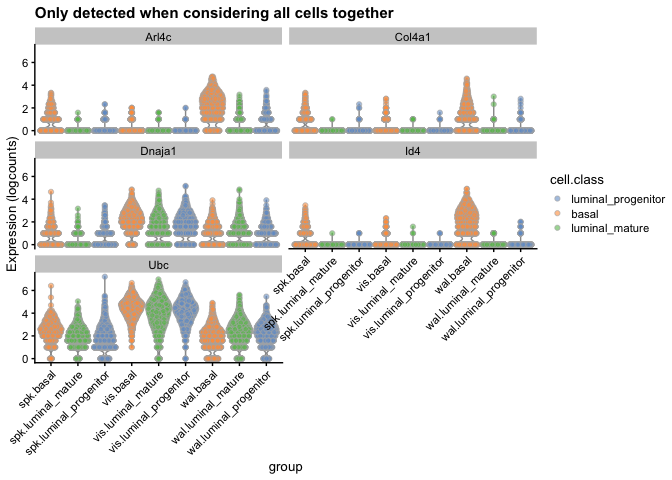<!-- -->

```r
scater::plotExpression(bct, features = s_all, 
                       x = "cell.class", colour_by = "cell.class") + 
  theme(axis.text.x = element_text(angle = 45, hjust = 1, vjust = 1)) + 
  ggtitle("Only detected when considering all cells together")
```

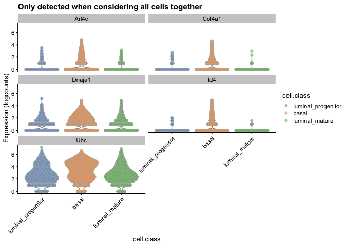<!-- -->

```r
## Genes only found with batch correction
(s_block <- head(intersect(
  rownames(markers_all[[subtype]][markers_all[[subtype]]$p.value > 0.95, ]),
  rownames(markers_block[[subtype]][markers_block[[subtype]]$p.value < 0.05, ])))
)
```

```
## [1] "Mt2"      "Hsp90aa1" "Itgb1"    "Mt1"
```

```r
markers_all[[subtype]][s_block, ]
```

```
## DataFrame with 4 rows and 4 columns
##                    p.value       FDR logFC.luminal_progenitor
##                  <numeric> <numeric>                <numeric>
## Mt2      0.999145979288044         1         1.08185005675888
## Hsp90aa1 0.999895394193033         1        0.379096742918043
## Itgb1    0.999999999999997         1        0.615094532684075
## Mt1                      1         1        0.676606595825248
##          logFC.luminal_mature
##                     <numeric>
## Mt2         0.337540563981384
## Hsp90aa1    0.510940927855906
## Itgb1       0.269018877963923
## Mt1         -0.16852699647291
```

```r
markers_block[[subtype]][s_block, ]
```

```
## DataFrame with 4 rows and 4 columns
##                       p.value                  FDR
##                     <numeric>            <numeric>
## Mt2      1.20892603345883e-45  4.3450223908432e-44
## Hsp90aa1 2.08768658251875e-08 5.66922889741759e-07
## Itgb1     0.00111352534736116   0.0256741127259498
## Mt1      0.000130392215068018  0.00312429974143369
##          logFC.luminal_progenitor logFC.luminal_mature
##                         <numeric>            <numeric>
## Mt2                1.574771331505     1.07730915693935
## Hsp90aa1        0.655779202927588    0.863700514280117
## Itgb1           0.673468193485559    0.604622275425466
## Mt1              1.20583609234114    0.685348602939104
```

```r
scater::plotExpression(bct, features = s_block, 
                       x = "group", colour_by = "cell.class") + 
  theme(axis.text.x = element_text(angle = 45, hjust = 1, vjust = 1)) + 
  ggtitle("Only detected when accounting for batches")
```

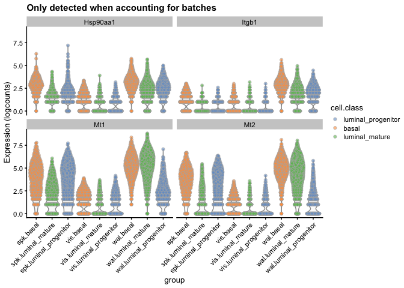<!-- -->

```r
scater::plotExpression(bct, features = s_block, 
                       x = "cell.class", colour_by = "cell.class") + 
  theme(axis.text.x = element_text(angle = 45, hjust = 1, vjust = 1)) + 
  ggtitle("Only detected when accounting for batches")
```

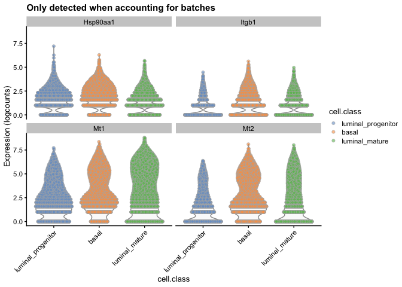<!-- -->

Another approach to incorporating batch information in the marker gene detection
is via the `design` argument of `findMarkers`. With this approach, the batch
variable as well as the cell type variable are used as predictors in a linear
model, with the gene expression as the response. This approach makes stronger
assumptions (e.g. on equality of variances, and that the batch effect is the
same across clusters) than using the `batch` argument, but can be used also when
not all cell types are present in all batches.


```r
## Set up the design matrix (remove the intercept for full rank
## in the final design matrix with the cluster-specific terms).
design <- model.matrix(~ bct$study)
head(design)
```

```
##   (Intercept) bct$studyvis bct$studywal
## 1           1            1            0
## 2           1            1            0
## 3           1            1            0
## 4           1            1            0
## 5           1            1            0
## 6           1            1            0
```

```r
design <- design[, -1, drop = FALSE]
markers_design <- scran::findMarkers(
  bct, clusters = bct$cell.class, lfc = 0.5,
  design = design, pval.type = "all", direction = "up"
)
```

# Cluster-wise t-tests with Seurat

The default testing regime of *[Seurat](https://CRAN.R-project.org/package=Seurat)* differs from that of 
*[scran](https://bioconductor.org/packages/3.9/scran)* in that the former compares the expression levels in one
cluster to those of all cells outside of the cluster. The default test is a
Wilcoxon test, but other options are available via the `test.use` argument. The
`FindMarkers` function can be used to compare one cluster to the rest of the
cells, or two specified clusters against each other. The `FindAllMarkers`
function automates the comparison of each of the clusters to the cells outside
that cluster. Using the Seurat object created in the beginning of the exercise,
we find the genes that are most discriminative of each cluster with respect to
genes outside the cluster.


```r
seurat_markers <- Seurat::FindAllMarkers(
  so, test.use = "wilcox", only.pos = TRUE, 
  min.pct = 0.25, logfc.threshold = 0.25
)
```

```
## Calculating cluster 1
```

```
## Calculating cluster 2
```

```
## Calculating cluster 3
```

```
## Calculating cluster 4
```

```
## Calculating cluster 5
```

```
## Calculating cluster 6
```

```
## Calculating cluster 7
```

```
## Calculating cluster 8
```

```r
(top2 <- seurat_markers %>% dplyr::group_by(cluster) %>% 
    dplyr::top_n(n = 2, wt = -p_val))
```

```
## # A tibble: 18 x 7
## # Groups:   cluster [8]
##        p_val avg_logFC pct.1 pct.2 p_val_adj cluster gene  
##        <dbl>     <dbl> <dbl> <dbl>     <dbl> <fct>   <chr> 
##  1 0.            2.88  0.933 0.044 0.        1       CD79A 
##  2 0.            2.03  0.851 0.054 0.        1       MS4A1 
##  3 0.            4.55  0.977 0.206 0.        2       S100A9
##  4 0.            4.15  0.937 0.115 0.        2       S100A8
##  5 0.            2.41  0.908 0.043 0.        2       LGALS2
##  6 0.            2.34  0.938 0.139 0.        2       FCN1  
##  7 2.32e-260     3.17  0.955 0.07  7.59e-256 3       GZMB  
##  8 1.21e-212     2.46  0.844 0.065 3.96e-208 3       FGFBP2
##  9 1.25e-137     0.751 1     0.995 4.09e-133 4       RPL32 
## 10 4.43e-137     0.799 1     0.992 1.45e-132 4       RPS27 
## 11 0.            4.06  0.909 0.002 0.        5       GP9   
## 12 0.            3.56  0.909 0.003 0.        5       ITGA2B
## 13 1.99e-226     0.684 0.536 0.01  6.51e-222 6       CDKN1C
## 14 8.60e-212     0.739 0.608 0.02  2.82e-207 6       HES4  
## 15 1.09e-245     2.37  0.975 0.215 3.55e-241 7       CCL5  
## 16 2.62e-184     1.46  0.907 0.205 8.57e-180 7       NKG7  
## 17 1.73e-117     1.04  0.975 0.615 5.68e-113 8       LTB   
## 18 2.40e-108     0.817 0.918 0.434 7.85e-104 8       IL32
```

Seurat also contains functions to visualize the expression of individual genes
across clusters, in reduced dimension representations, and in a heatmap. The
`DotPlot` function can be used to visualize the average expression as well as
the fraction of cells expressing a gene in each cluster.


```r
Seurat::VlnPlot(so, features = c("MS4A1", "CD79A"), pt.size = 0.25)
```

<!-- -->

```r
Seurat::FeaturePlot(so, features = c("MS4A1", "CD79A"))
```

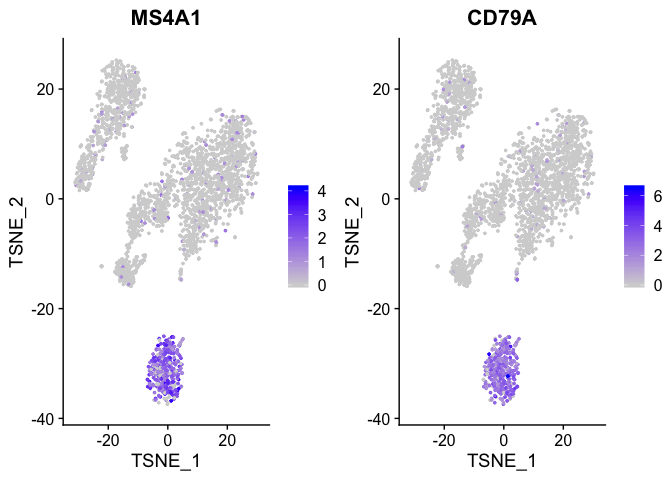<!-- -->

```r
Seurat::DoHeatmap(so, features = top2$gene) + NoLegend()
```

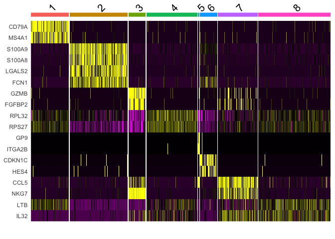<!-- -->

```r
Seurat::DotPlot(so, features = top2$gene) + RotatedAxis()
```

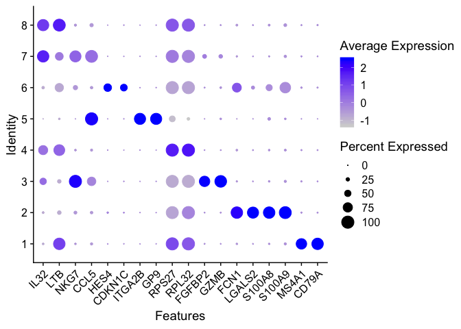<!-- -->

# Session info


```r
sessionInfo()
```

```
## R version 3.6.1 (2019-07-05)
## Platform: x86_64-apple-darwin15.6.0 (64-bit)
## Running under: macOS High Sierra 10.13.6
## 
## Matrix products: default
## BLAS:   /Library/Frameworks/R.framework/Versions/3.6/Resources/lib/libRblas.0.dylib
## LAPACK: /Library/Frameworks/R.framework/Versions/3.6/Resources/lib/libRlapack.dylib
## 
## locale:
## [1] en_US.UTF-8/en_US.UTF-8/en_US.UTF-8/C/en_US.UTF-8/en_US.UTF-8
## 
## attached base packages:
## [1] parallel  stats4    stats     graphics  grDevices utils     datasets 
## [8] methods   base     
## 
## other attached packages:
##  [1] edgeR_3.26.8                limma_3.40.6               
##  [3] igraph_1.2.4.1              Seurat_3.1.1               
##  [5] pheatmap_1.0.12             BiocSingular_1.0.0         
##  [7] scran_1.12.1                scater_1.12.2              
##  [9] ggplot2_3.2.1               TENxPBMCData_1.2.0         
## [11] HDF5Array_1.12.2            rhdf5_2.28.1               
## [13] SingleCellExperiment_1.6.0  SummarizedExperiment_1.14.1
## [15] DelayedArray_0.10.0         BiocParallel_1.18.1        
## [17] matrixStats_0.55.0          Biobase_2.44.0             
## [19] GenomicRanges_1.36.1        GenomeInfoDb_1.20.0        
## [21] IRanges_2.18.3              S4Vectors_0.22.1           
## [23] BiocGenerics_0.30.0         BiocStyle_2.12.0           
## 
## loaded via a namespace (and not attached):
##   [1] backports_1.1.5               AnnotationHub_2.16.1         
##   [3] BiocFileCache_1.8.0           plyr_1.8.4                   
##   [5] lazyeval_0.2.2                splines_3.6.1                
##   [7] listenv_0.7.0                 digest_0.6.21                
##   [9] htmltools_0.4.0               viridis_0.5.1                
##  [11] fansi_0.4.0                   gdata_2.18.0                 
##  [13] magrittr_1.5                  memoise_1.1.0                
##  [15] cluster_2.1.0                 ROCR_1.0-7                   
##  [17] globals_0.12.4                RcppParallel_4.4.4           
##  [19] R.utils_2.9.0                 colorspace_1.4-1             
##  [21] blob_1.2.0                    rappdirs_0.3.1               
##  [23] ggrepel_0.8.1                 xfun_0.10                    
##  [25] dplyr_0.8.3                   jsonlite_1.6                 
##  [27] crayon_1.3.4                  RCurl_1.95-4.12              
##  [29] zeallot_0.1.0                 zoo_1.8-6                    
##  [31] survival_2.44-1.1             ape_5.3                      
##  [33] glue_1.3.1                    gtable_0.3.0                 
##  [35] zlibbioc_1.30.0               XVector_0.24.0               
##  [37] leiden_0.3.1                  Rhdf5lib_1.6.2               
##  [39] future.apply_1.3.0            scales_1.0.0                 
##  [41] DBI_1.0.0                     bibtex_0.4.2                 
##  [43] Rcpp_1.0.2                    metap_1.1                    
##  [45] viridisLite_0.3.0             xtable_1.8-4                 
##  [47] reticulate_1.13               dqrng_0.2.1                  
##  [49] bit_1.1-14                    rsvd_1.0.2                   
##  [51] SDMTools_1.1-221.1            tsne_0.1-3                   
##  [53] htmlwidgets_1.5.1             httr_1.4.1                   
##  [55] gplots_3.0.1.1                RColorBrewer_1.1-2           
##  [57] ica_1.0-2                     pkgconfig_2.0.3              
##  [59] R.methodsS3_1.7.1             uwot_0.1.4                   
##  [61] dbplyr_1.4.2                  utf8_1.1.4                   
##  [63] locfit_1.5-9.1                dynamicTreeCut_1.63-1        
##  [65] labeling_0.3                  reshape2_1.4.3               
##  [67] tidyselect_0.2.5              rlang_0.4.0                  
##  [69] later_1.0.0                   AnnotationDbi_1.46.1         
##  [71] munsell_0.5.0                 tools_3.6.1                  
##  [73] cli_1.1.0                     RSQLite_2.1.2                
##  [75] ExperimentHub_1.10.0          ggridges_0.5.1               
##  [77] evaluate_0.14                 stringr_1.4.0                
##  [79] fastmap_1.0.1                 yaml_2.2.0                   
##  [81] npsurv_0.4-0                  knitr_1.25                   
##  [83] bit64_0.9-7                   fitdistrplus_1.0-14          
##  [85] caTools_1.17.1.2              purrr_0.3.2                  
##  [87] RANN_2.6.1                    pbapply_1.4-2                
##  [89] future_1.14.0                 nlme_3.1-141                 
##  [91] mime_0.7                      R.oo_1.22.0                  
##  [93] compiler_3.6.1                png_0.1-7                    
##  [95] plotly_4.9.0                  beeswarm_0.2.3               
##  [97] curl_4.2                      interactiveDisplayBase_1.22.0
##  [99] lsei_1.2-0                    tibble_2.1.3                 
## [101] statmod_1.4.32                stringi_1.4.3                
## [103] lattice_0.20-38               Matrix_1.2-17                
## [105] vctrs_0.2.0                   lifecycle_0.1.0              
## [107] pillar_1.4.2                  BiocManager_1.30.7           
## [109] Rdpack_0.11-0                 lmtest_0.9-37                
## [111] RcppAnnoy_0.0.13              BiocNeighbors_1.2.0          
## [113] data.table_1.12.4             cowplot_1.0.0                
## [115] bitops_1.0-6                  irlba_2.3.3                  
## [117] gbRd_0.4-11                   httpuv_1.5.2                 
## [119] R6_2.4.0                      promises_1.1.0               
## [121] KernSmooth_2.23-15            gridExtra_2.3                
## [123] vipor_0.4.5                   codetools_0.2-16             
## [125] MASS_7.3-51.4                 gtools_3.8.1                 
## [127] assertthat_0.2.1              withr_2.1.2                  
## [129] sctransform_0.2.0             GenomeInfoDbData_1.2.1       
## [131] beachmat_2.0.0                grid_3.6.1                   
## [133] tidyr_1.0.0                   rmarkdown_1.16               
## [135] DelayedMatrixStats_1.6.1      Rtsne_0.15                   
## [137] shiny_1.4.0                   ggbeeswarm_0.6.0
```

# References

