Inferring a trajectory with slingshot
================

``` r
library(tidyverse)
library(slingshot)
library(Seurat)
library(tradeSeq)
library(S4Vectors)
library(SingleCellExperiment)
```

Slingshot is one of many trajectory inference (TI) methods (Saelens et
al. 2019). As you can see through the [dynverse guidelines
app](guidelines.dynverse.org), it’s relatively fast and can detect
linear, bifurcating and tree trajectories accurately. Note that it won’t
detect any disconnected or cyclic trajectories. That’s why we have to
filter out the cells first, so that only the connected clusters are
kept.

``` r
seu_trajectory <- read_rds("data/adipose_differentiation-merick/seu_trajectory.rds")
feature_info <- read_tsv("data/adipose_differentiation-merick/feature_info.tsv")
```

    ## Parsed with column specification:
    ## cols(
    ##   feature_id = col_character(),
    ##   symbol = col_character()
    ## )

``` r
feature_mapper <- function(x) {feature_info %>% dplyr::slice(base::match(symbol, x)) %>% dplyr::pull(feature_id)}
```

Slingshot is one of the most prototypical TI methods, as it contains
many popular components that can also be found in other TI methods
(Cannoodt, Saelens, and Saeys 2016): dimensionality reduction,
clustering and principal curves.

## Dimensionality reduction

There are three reasons why most TI methods, such as Slingshot, first
reduce the dimensions of the data. These follow a similar reasoning as
for clustering.

  - Noise reduction. Although most differences in expression are
    (hopefully) biologically meaningful, a considerable amount of
    variance in the data is due to noise.

  - Making euclidean distance meaningful. Euclidean distances are often
    not meaningful in the original counts or normalized expression
    matrices, because of differences in library sizes. Note that
    normalization and scaling may mitigate this issue.

  - Curse of dimensionality. Some downstream methods, such as a
    knn-graph, can be very sensitive to high dimensions. Often, the
    nearest neighbours in high dimensions tend to cluster around “hub”
    points, that are actually far apart if you only look at the
    biological signal in the data. Reducing the number of dimensions can
    mitigate this issue.

As many other TI methods, Slingshot is not restricted to a particular
dimensionality reduction method. So which one should you use? There are
three important points to take into account:

  - You should use enough dimensions to capture the whole complexity of
    the data. This is especially important for linear dimensionality
    reductions such as PCA and MDS, and if the trajectory topology is
    more complex than a bifurcation. Note that even when the trajectory
    is not clearly visible in two dimensions, the TI method may still
    see it in multiple dimensions. TI methods can see in a lot more
    dimensions compare to use silly earthlings\!

  - Some dimensionality reduction methods may enlarge (or *blow up*) the
    distance in high-density regions. t-SNE and, to a lesser extent
    UMAP, have this problem. The dataset that we have here doesn’t
    really have this problem, but it is quite common if you do an
    unbiased sampling of your biological populations.

  - Some dimensionality reduction methods try to *enforce* a grouping of
    the cells, and remove continuities. t-SNE and, to a lesser extent
    UMAP, have this problem. These same methods may also put cells
    together that actually do not

For these reasons, MDS and diffusion maps are often the preferred choice
, although t-SNE and UMAP may work if you have a balanced and simple
sample.

Let’s try out MDS and UMAP.

``` r
set.seed(1)

# MDS, we use the landmark mds because it is much faster and memory efficient
lmds <- dyndimred::dimred_landmark_mds(Matrix::t(seu_trajectory@assays$spliced@scale.data))
colnames(lmds) <- paste0("lmds_", seq_len(ncol(lmds)))
lmds_object <- CreateDimReducObject(lmds, key = "lmds_", assay = "spliced")
seu_trajectory@reductions$lmds <- lmds_object
```

``` r
DimPlot(seu_trajectory, reduction = "lmds",pt.size = 0.5, label = TRUE, repel = TRUE)
```

    ## Warning: Using `as.character()` on a quosure is deprecated as of rlang 0.3.0.
    ## Please use `as_label()` or `as_name()` instead.
    ## This warning is displayed once per session.

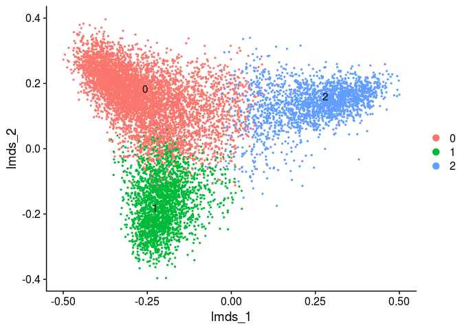<!-- -->

``` r
seu_trajectory <- RunUMAP(seu_trajectory, dims = 1:50, umap.method = "uwot")
```

    ## Warning: The default method for RunUMAP has changed from calling Python UMAP via reticulate to the R-native UWOT using the cosine metric
    ## To use Python UMAP via reticulate, set umap.method to 'umap-learn' and metric to 'correlation'
    ## This message will be shown once per session

    ## 14:34:15 UMAP embedding parameters a = 0.9922 b = 1.112

    ## 14:34:15 Read 9907 rows and found 50 numeric columns

    ## 14:34:15 Using Annoy for neighbor search, n_neighbors = 30

    ## 14:34:15 Building Annoy index with metric = cosine, n_trees = 50

    ## 0%   10   20   30   40   50   60   70   80   90   100%

    ## [----|----|----|----|----|----|----|----|----|----|

    ## **************************************************|
    ## 14:34:17 Writing NN index file to temp file /tmp/RtmpbliQUJ/file1d673f8477de
    ## 14:34:17 Searching Annoy index using 1 thread, search_k = 3000
    ## 14:34:20 Annoy recall = 100%
    ## 14:34:21 Commencing smooth kNN distance calibration using 1 thread
    ## 14:34:22 Initializing from normalized Laplacian + noise
    ## 14:34:23 Commencing optimization for 500 epochs, with 438618 positive edges
    ## 14:34:49 Optimization finished

``` r
DimPlot(seu_trajectory, reduction = "umap",pt.size = 0.5, label = TRUE, repel = TRUE)
```

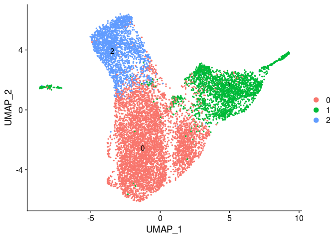<!-- -->

Both dimensionality reductions look alike, although you may appreciate
the more ‘granular’ look of a UMAP. This may or may not indicate some
extra subpopulations…

## Clustering

We want to find continuities in our data, why then do so many TI methods
use methods that split up the data in distinct groups using clustering?

The answer is simple: clustering simplifies the problem by finding
groups of cells that are at approximately the same location in the
trajectory. These groups can then be connected to find the different
paths that cells take, and where they branch off.

Ideally, the clustering method for TI should therefore not group cells
based on a density, such as DBSCAN A trajectory is by definition a group
of cells that are all connected through high-density regions, but still
differ in their expression.

We’ll use standard Seurat clustering here (louvain clustering), but
alternative methods may be appropriate as well. Sometimes, it may be
useful to ‘overcluster’ to make sure that all subbranches are captured.

We’ll increase the resolution a bit, so that we find more granular
clusters. As an exercise, you might tweak this resolution a bit and see
how it affects downstream analyses.

``` r
set.seed(1)
seu_trajectory <- FindNeighbors(seu_trajectory, verbose = FALSE) %>% 
  FindClusters(resolution = 0.25, verbose = FALSE)
```

## Finding lineages

``` r
dimred <- seu_trajectory@reductions$lmds@cell.embeddings
clustering <- seu_trajectory@meta.data$spliced_snn_res.0.25

set.seed(1)
lineages <- getLineages(dimred, clustering)
```

    ## Using full covariance matrix

``` r
lineages
```

    ## class: SlingshotDataSet 
    ## 
    ##  Samples Dimensions
    ##     9907          2
    ## 
    ## lineages: 2 
    ## Lineage1: 1  5  4  0  2  
    ## Lineage2: 1  5  4  3  
    ## 
    ## curves: 0

``` r
plot.new()
plot(dimred, col = RColorBrewer::brewer.pal(9,"Set1")[clustering], asp = 1, pch = 16)
lines(lineages, lwd = 3, col = 'black')
```

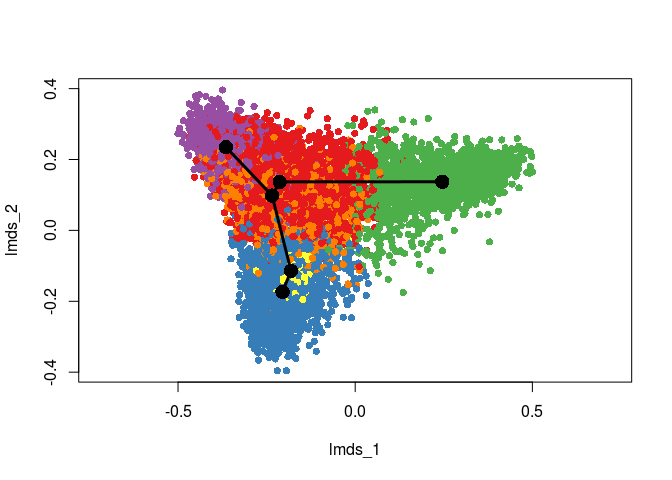<!-- -->

Here we see one central issue with trajectory analysis: where does the
trajectory begin? Without any extra information, this is nearly an
impossible task for a TI method. In this particular case, we know that
our progenitor population expresses the Dpp4 (Cd26). We can thus look
for the cluster that expresses Dpp4

``` r
start_cluster_id <- tibble(
  expression = seu_trajectory@assays$spliced@counts[feature_mapper("Dpp4"), ],
  cluster_id = clustering
) %>% 
  group_by(cluster_id) %>% 
  summarise(expression = mean(expression)) %>% 
  arrange(desc(expression)) %>% 
  pull(cluster_id) %>% 
  dplyr::first() %>% 
  as.character()
```

We use this cluster as our start. YOu won’t see any difference now, but
defining a correct start cluster is important for the next step:

``` r
set.seed(1)
lineages <- getLineages(dimred, clustering, start.clus = start_cluster_id)
```

    ## Using full covariance matrix

``` r
lineages
```

    ## class: SlingshotDataSet 
    ## 
    ##  Samples Dimensions
    ##     9907          2
    ## 
    ## lineages: 2 
    ## Lineage1: 3  4  5  1  
    ## Lineage2: 3  4  0  2  
    ## 
    ## curves: 0

## Principal curves

Once the clusters are connected, Slingshot allows you to transform them
to a smooth trajectory using principal curves. This is an algorithm that
iteratively changes an initial curve to better match the data
points:


This alogirthm was developed for linear data. To apply it to single-cell
data, slingshot adds two enhancements:

  - It will run principal curves for each ‘lineage’, which is a set of
    clusters that go from a defined start cluster to some end cluster
  - Lineages with a same set of clusters will be constrained so that
    their principal curves remain bundled around the overlapping
    clusters

<!-- end list -->

``` r
curves <- getCurves(lineages)
curves
```

    ## class: SlingshotDataSet 
    ## 
    ##  Samples Dimensions
    ##     9907          2
    ## 
    ## lineages: 2 
    ## Lineage1: 3  4  5  1  
    ## Lineage2: 3  4  0  2  
    ## 
    ## curves: 2 
    ## Curve1: Length: 0.85679  Samples: 5852.73
    ## Curve2: Length: 1.0865   Samples: 7146.78

``` r
plot(dimred, col = RColorBrewer::brewer.pal(9,"Set1")[clustering], asp = 1, pch = 16)
lines(curves, lwd = 3, col = 'black')
```

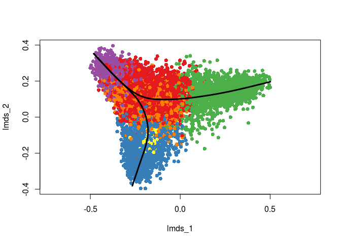<!-- -->

Unfortunately, Slingshot doesn’t export the functions that generate the
plotting data, so it’s harde to customize this plot.

## Finding differentially expressed genes

The main way to interpret a trajectory is to find genes that change
along the trajectory. There are many ways to define differential
expression along a trajectory:

  - Expression changes along a particular path (i.e. change with
    pseudotime)
  - Expression differences between branches
  - Expression changes at branch points
  - Expression changes somewhere along the trajectory
  - …

tradeSeq is a recently proposed algorithm to find trajectory
differentially expressed genes. It works by smoothing the gene
expression along the trajectory by fitting a smoother using generalized
additive models (GAMs), and testing whether certain coefficients are
statstically different between points in the trajectory.

``` r
BiocParallel::register(BiocParallel::SerialParam())
```

The fitting of GAMs can take quite a while, so for demonstration
purposes we first do a very stringent filtering of the genes. In an
ideal experiment, you would use all the genes, or at least those defined
as being variable (e.g. through Seurat’s `FindVariableFeatures()`).

``` r
counts <- seu_trajectory@assays$spliced@counts
filt <- rowSums(counts > 8) > ncol(counts)/100
sum(filt)
```

    ## [1] 217

``` r
counts <- counts[filt, ]
```

``` r
sce <- fitGAM(
  counts = as.matrix(counts),
  sds = curves
)
```

tradeSeq uses cubic splines for smoothing, which will use a number of
knots. More knots will allow more flexibility, but also increase the
risk of overfitting. We went with the default number of knots here
(`nknots = 6`). They can also be estimated using `evaluateK` function,
but this can take a couple of hours to run.

Let’s have a look at the location of these knots.

``` r
plotGeneCount(curves, counts, clusters = clustering, models = sce)
```

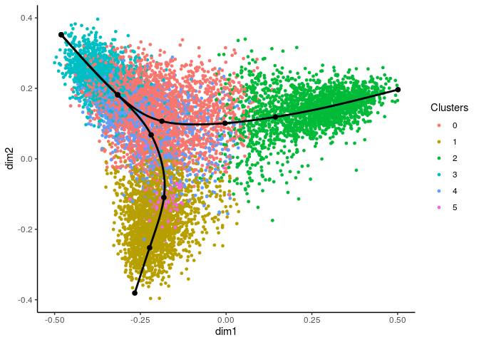<!-- -->

### Genes that change with pseudotime

``` r
pseudotime_association <- associationTest(sce)
head(pseudotime_association)
```

    ##                        waldStat df pvalue
    ## ENSMUSG00000020676.2  2066.5668  9      0
    ## ENSMUSG00000000753.15  969.9812  9      0
    ## ENSMUSG00000001025.8  1726.4569  9      0
    ## ENSMUSG00000001119.7   720.5547  9      0
    ## ENSMUSG00000020241.13  910.2147  9      0
    ## ENSMUSG00000001175.15  470.7354  9      0

``` r
hist(pseudotime_association$pvalue)
```

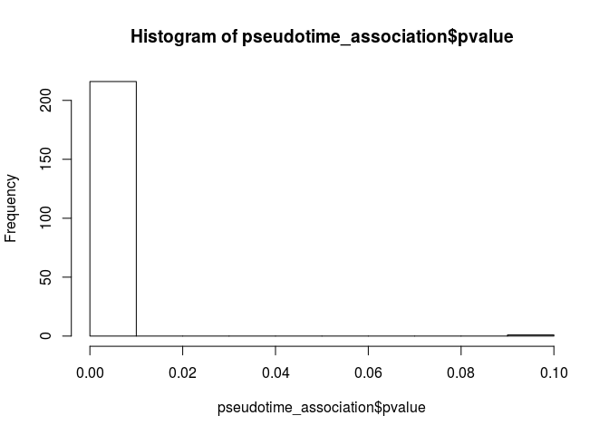<!-- -->

Apparently, almost all of the 200 selected genes are differentially
expressed along pseudotime. Apart from a (corrected) p-value, we also
get a Wald test statistic, which can be used to rank the genes based on
their strong dependency on pseudotime. Let’s investigate…

``` r
pseudotime_association <- pseudotime_association %>% 
  rownames_to_column("feature_id") %>% 
  arrange(desc(waldStat))
```

``` r
# helper function for plotting a gene's differential expression
plot_differential_expression <- function(feature_id) {
  patchwork::wrap_plots(
    plotGeneCount(curves, counts, clusters = clustering, models = sce, gene = feature_id) + theme(legend.position = "none"),
    plotSmoothers(sce, counts, gene = feature_id)
  )
}
```

``` r
feature_id <- pseudotime_association$feature_id[[1]]
plot_differential_expression(feature_id)
```

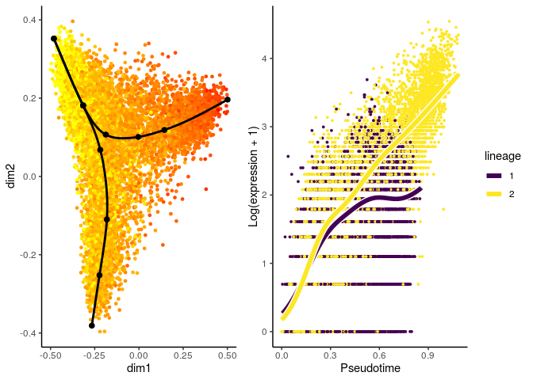<!-- -->

``` r
feature_id <- pseudotime_association %>% filter(pvalue < 0.05) %>% top_n(1, -waldStat) %>% pull(feature_id)
plot_differential_expression(feature_id)
```

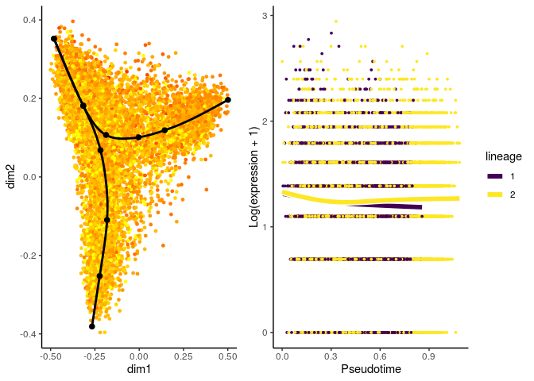<!-- -->

The first gene is clearly differentially expressed, the second gene
clearly isn’t. So why are they both significant?

Because we’re working with thousands of cells, even slight changes in
expression become significant. This is also a problem in differential
expression analysis between clusters (as will probably be discussed
tomorrow). As in bulk transcriptomics, this issue may be solved by also
looking at the biological significance of the differential expression
(e.g. the fold change). We could use the Wald test-statistic for this,
although it’s not as easy to interpret compared to a fold-change.

``` r
hist(pseudotime_association$waldStat)
```

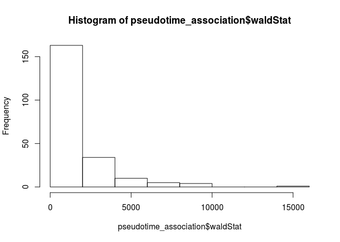<!-- -->

### Genes that change between two pseudotime points

We can define custom pseudotime values of interest if we’re interested
in genes that change between particular point in pseudotime. By default,
we can look at differences between start and end:

``` r
pseudotime_start_end_association <- startVsEndTest(sce)
```

``` r
feature_id <- pseudotime_start_end_association %>% 
  rownames_to_column("feature_id") %>% 
  filter(pvalue < 0.05) %>% 
  top_n(1, waldStat) %>% 
  pull(feature_id)
plot_differential_expression(feature_id)
```

<!-- -->

We can also look at genes that change at a particular point in
pseudotime:

``` r
pseudotime_middle_association <- startVsEndTest(sce, pseudotimeValues = c(0.5, 0.6))
```

``` r
feature_id <- pseudotime_middle_association %>% 
  rownames_to_column("feature_id") %>% 
  filter(pvalue < 0.05) %>% 
  top_n(1, waldStat) %>% 
  pull(feature_id)
plot_differential_expression(feature_id)
```

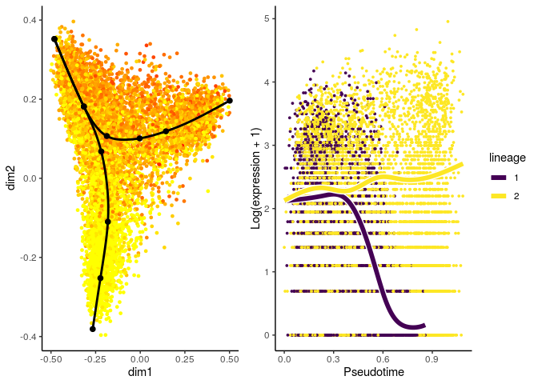<!-- -->

### Genes that are different between lineages

More interesting are genes that are different between two branches. We
may have seen some of these genes already pop up in previous analyses of
pseudotime. There are several ways to define “different between
branches”, and each have their own functions:

  - Different at the end points, using `diffEndTest`
  - Different at the branching point, using `earlyDETest`
  - Different somewhere in pseudotime the branching point, using
    `patternTest`

Note that the last function requires that the pseudotimes between two
lineages are aligned.

``` r
different_end_association <- diffEndTest(sce)
```

``` r
feature_id <- different_end_association %>% 
  rownames_to_column("feature_id") %>% 
  filter(pvalue < 0.05) %>% 
  arrange(desc(waldStat)) %>% 
  dplyr::slice(1) %>% 
  pull(feature_id)
plot_differential_expression(feature_id)
```

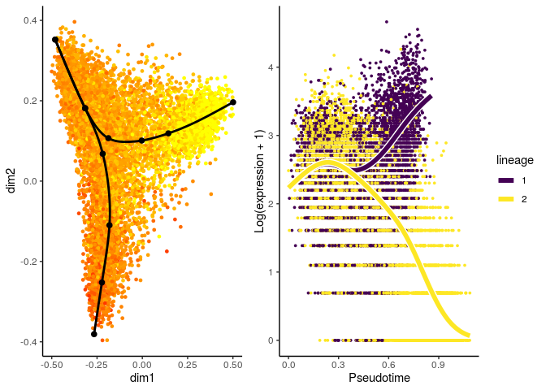<!-- -->

``` r
branch_point_association <- earlyDETest(sce)
```

``` r
feature_id <- branch_point_association %>% 
  rownames_to_column("feature_id") %>% 
  filter(pvalue < 0.05) %>% 
  arrange(desc(waldStat)) %>% 
  dplyr::slice(1) %>% 
  pull(feature_id)
plot_differential_expression(feature_id)
```

<!-- -->

In this case, both tests give the same top genes. Some genes are
different though, if we specifically look for them:

``` r
feature_id <- left_join(
  different_end_association %>% 
    rename_all(~ paste0(., "_end")) %>% 
    rownames_to_column("feature_id"),
  branch_point_association %>% 
    rename_all(~ paste0(., "_branch")) %>% 
    rownames_to_column("feature_id"),
  'feature_id'
) %>%
  filter(waldStat_branch > quantile(waldStat_branch, 0.8)) %>% 
  mutate(ratio = waldStat_end / waldStat_branch) %>% 
  arrange(ratio) %>% 
  top_n(1, -ratio) %>% 
  pull(feature_id)

plot_differential_expression(feature_id)
```

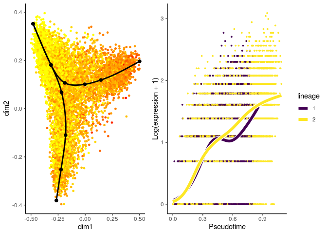<!-- -->

Check out [this
vignette](https://statomics.github.io/tradeSeq/articles/tradeSeq.html)
for a more in-depth overview of tradeSeq

## References

<div id="refs" class="references">

<div id="ref-cannoodtComputationalMethodsTrajectory2016">

Cannoodt, Robrecht, Wouter Saelens, and Yvan Saeys. 2016. “Computational
Methods for Trajectory Inference from Single-Cell Transcriptomics.”
*European Journal of Immunology* 46 (11): 2496–2506.
<https://doi.org/10.1002/eji.201646347>.

</div>

<div id="ref-saelensComparisonSinglecellTrajectory2019">

Saelens, Wouter, Robrecht Cannoodt, Helena Todorov, and Yvan Saeys.
2019. “A Comparison of Single-Cell Trajectory Inference Methods.”
*Nature Biotechnology* 37 (5): 547–54.
<https://doi.org/10.1038/s41587-019-0071-9>.

</div>

</div>
